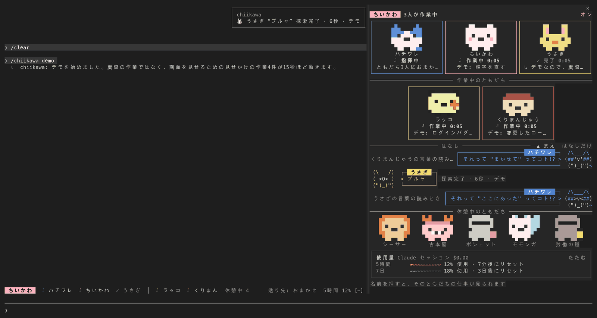
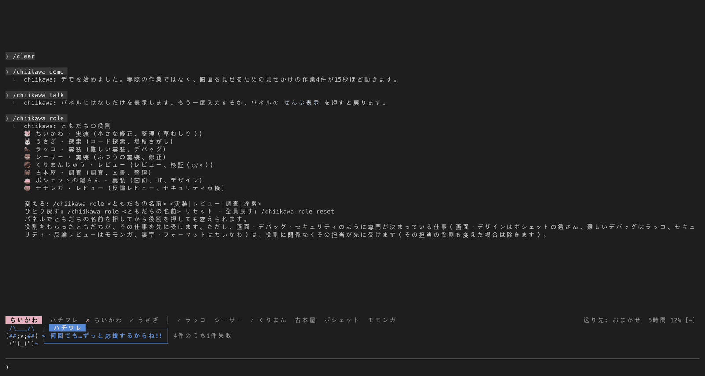
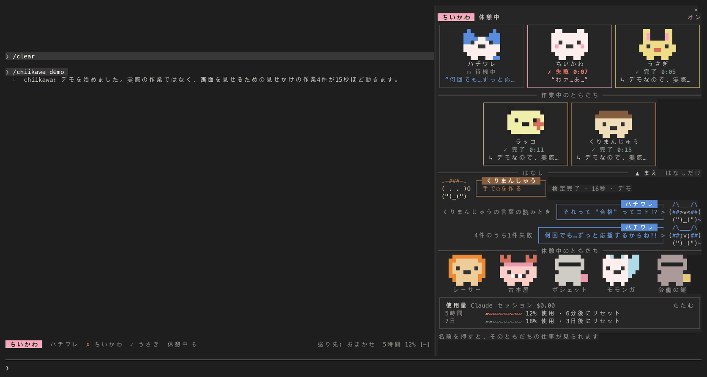
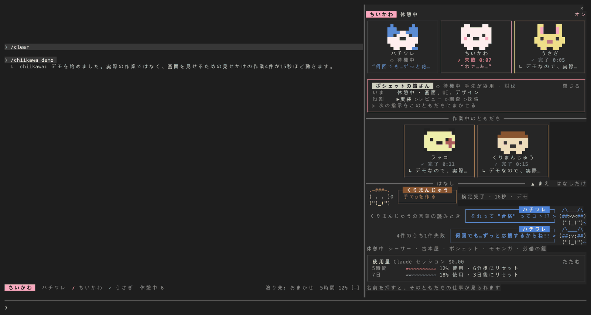
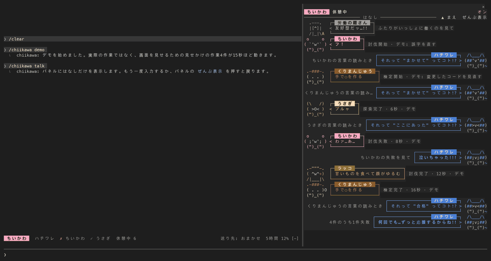
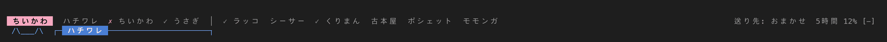

# chiikawa — ちいかわモード for Claude Code

[English](README.md) · [한국어](README.ko.md) · 日本語

Claude Code の中で、**ハチワレが指揮をとり、ちいかわ・うさぎとともだちが仕事を受け持って、漫画のようにおしゃべりする** mod（プラグイン）です。だれがいま何をしているのかを、キャラクターごとのコマとふきだしで見せます。漫画「ちいかわ」のファンが作った**非公式のファン mod** で、原作者のナガノさん、出版社、アニメの製作会社などの権利者とは関係がなく、許諾も受けていません。公式の絵やロゴは使っていません。画面の文字絵とピクセルアイコンは、この mod のために描いたものです。英語・韓国語・日本語で動きます（基本は英語、韓国語のユーザーには韓国語、日本語のユーザーには日本語）。バージョン 0.2.0。



ハチワレに「ラッコにログインバグの原因をさがしてもらって、くりまんじゅうに直したコードのレビューを、古本屋に調査をまかせて」と頼むと、右のパネルに3人がそれぞれ働く様子が出ます。終わるとハチワレが結果をまとめて伝えます。しゃべれないともだち（ちいかわ、うさぎ、くりまんじゅう、古本屋）は声としぐさだけで、ハチワレがその意味を読みといてくれます。

> スクリーンショットは、実際の Claude Code セッション（サンプルフォルダー `hello-app`）のターミナル出力を、文字と色そのままに画像にしたもので、使用量の数字は例の値です。フォントや色は、お使いのターミナルによって少し違って見えることがあります。

## 目次

- [インストール (3分)](#インストール-3分)
- [はじめて使う](#はじめて使う)
- [ともだちと役割](#ともだちと役割)
- [画面に見えるもの](#画面に見えるもの)
- [コマンド](#コマンド)
- [設定](#設定)
- [言語](#言語)
- [困ったときは](#困ったときは)
- [この mod がコンピューターですること](#この-mod-がコンピューターですること)
  - [プライバシー](#プライバシー)
- [AI にインストールと利用をまかせるには](#ai-にインストールと利用をまかせるには)
- [Orca fleet-run 連携 (任意)](#orca-fleet-run-連携-任意)
- [開発](#開発)
- [知っておくことと出典](#知っておくことと出典)

## インストール (3分)

### 用意するもの

- **Claude Code**: ターミナルで `claude` と打って動かすプログラムです。まだなければ、[Claude Code の紹介ページ](https://claude.com/claude-code)の案内に沿って先にインストールしてください。
- この mod は Claude Code 2.1.291 で作り、テストしました。バージョンは `claude --version` で確認し、古ければ `claude update` で上げます。
- ほかに必要なものはありません。Node.js などを別に入れる必要はありません。

### インストールする

1. ターミナルを開いて `claude` を実行します。
2. Claude Code の入力欄に、次の1行をそのまま貼り付けて Enter を押します。

   ```
   /plugin install chiikawa --marketplace techkwon/chiikawa
   ```

3. 画面の質問に答えます。
   - マーケットプレイスを追加するか聞かれたら、承認します。マーケットプレイスとは、プラグインを取ってくる場所（ここではこの GitHub リポジトリ）を Claude Code に登録しておくものです。
   - インストール範囲（scope、この mod をどこで使うか）を選ぶ画面が出たら、user を選びます。すべてのプロジェクトで使えるようになります。
   - 設定を聞く画面が出たら、変えたいものがなければそのまま進みます。あとで変えられます。
4. インストールが終わったという行が出れば完了です。`/chiikawa` がすぐに出てこないときは、Claude Code を再起動してください。

同じインストールを、ターミナル（Claude Code の外）から2行で行うこともできます。

```
claude plugin marketplace add techkwon/chiikawa
claude plugin install chiikawa@chiikawa
```

インストールのときに設定も渡すには `--config` を付けます（何度でも書けます）。たとえば画面を韓国語に固定するには、次のようにします。

```
claude plugin install chiikawa@chiikawa --config language=ko
```

### インストールできたか確認する

ターミナルで `claude plugin list` を実行して、一覧に `chiikawa@chiikawa` があるか見ます。そのあと Claude Code の入力欄に `/chiikawa` と入力します。ともだちの状況パネルが開き、`ともだちの状況パネルを開きました。`（英語の画面なら `Opened the friends' status pane.`）と出れば大丈夫です。

### ほかの入れ方 (リポジトリを直接取ってくる)

```
git clone https://github.com/techkwon/chiikawa.git
claude --plugin-dir ./chiikawa
```

この方法では、そのセッションだけ mod を読み込みます。mod を直してみるときや、インストールせずに少し試すときに使います。

### アップデートと削除

ターミナル（Claude Code の外）で実行します。

```
claude plugin update chiikawa@chiikawa
claude plugin uninstall chiikawa@chiikawa
```

アップデートは、取ってきたあと Claude Code を再起動すると反映されます。少しのあいだだけ止めたいときは、削除せずに `/chiikawa off` を使ってください。`/chiikawa on` でまたオンになります。オン・オフの状態はそのセッションの状態にだけ置き、ディスクには保存しません。既定はオンです。

`claude plugin uninstall` が消すのは mod だけです。次の3つは、別に消す必要があるかもしれません。くわしくは[プライバシー](#プライバシー)にあります。

- **保存された役割と言語**: mod のフォルダーではなく、Claude Code のプラグインストアにあります。ヘルプによると、`claude plugin uninstall` は `--keep-data` を付けないかぎり、プラグインの保存データのフォルダーを消します。ただし、そのときこの2つの値まで消えるとは、この文書は約束しません。確実に消すには、削除する前に Claude Code で `/chiikawa role reset` と `/chiikawa lang auto` を入力してください。いちばん最後に行ってください。そのあとにハングルやかなで依頼を入力すると、言語をもう一度覚えます。
- **マーケットプレイスの登録**（mod を取ってきた場所の記録）: 消すコマンドは別にあります。`claude plugin marketplace remove chiikawa`。
- **Orca の話し方の写し**: Orca を `orcaVoice` をオンにして使ったときだけあります。作業指示ファイルのとなりにある `<名前>.chiikawa-<キャラクター>.md` というファイルです。mod はこのファイルを消しません。いらないものは手で消してください。

## はじめて使う

次の文は、そのまま入力して試せます。

1. **デモを見る**: 実際の作業はしません。見せかけの作業4件（うさぎの探索、ラッコの討伐、ちいかわの誤字直し、くりまんじゅうのレビュー）が15秒ほど動いて、画面がどう動くかを見せます。ちいかわの仕事はわざと失敗で終わるので、失敗したときの様子も見られます。

   ```
   /chiikawa demo
   ```

2. **軽い仕事は3人でいっしょに**: ふだんどおりに頼みます。ファイルをいくつか読んで少し直すくらいの仕事は、ほかのともだちを呼ばずにハチワレがじぶんでやります。このとき画面には、うさぎがさがし、ちいかわが直している様子が出ます。

   ```
   README.md でインストール方法が書いてあるところをさがして、誤字があれば直して。
   ```

3. **ともだちを指名してまかせる**: 名前を入れて頼むと、そのともだちにまかせます。ともだちにまかせた仕事はサブエージェント（メインのセッションが別に立ち上げる補助の AI）が行い、そのともだちの話し方で報告します。

   ```
   ラッコに src/index.js のバグの原因をさがしてもらって、くりまんじゅうには直したコードをレビューしてもらって。
   ```

   次の依頼をまるごとひとりにまかせるには、先に `/chiikawa ラッコ` と入力し、続けてやってほしいことを入力します。

4. **役割を変える**: ラッコにレビューをまかせたいときは、次のように入力します。パネルでともだちの名前を押してから役割のボタンを押しても変えられます。

   ```
   /chiikawa role ラッコ レビュー
   ```

5. **はなしだけを見る**: ともだちがやりとりした言葉だけを、パネルいっぱいに見ます。もう一度入力すると戻ります。

   ```
   /chiikawa talk
   ```

6. **使用量を見る**: パネルの使用量カードと入力欄の上の帯に、コンテキストの残り（この会話が一度に覚えていられる量）とプランの上限が出ます。文字で見るには `/chiikawa usage`。

7. **言語を変える**: 画面が望む言語でないときは、次のように選びます。`en` は英語、`ko` は韓国語です。

   ```
   /chiikawa lang ja
   ```

ともだちに仕事を分けてまかせると、ともだちごとに別々にトークン（AI が読み書きする文章の量を数える単位）を使います。そのためこの mod は、軽い仕事はじぶんでやり、手間のかかる仕事だけをまかせるよう、モデルに指示します。実際にまかせるかどうかは、モデルが依頼を見て決めます。

## ともだちと役割

| ともだち | しるし | 原作では | 基本の役割 | 受け持つ仕事 | 話し方 |
|---|---|---|---|---|---|
| ハチワレ | 🐱 | ねこ？ · 草むしり検定5級 | 指揮 | 仕事の割りふり、ともだちの言葉の読みとき。メインのセッション（いま話している Claude）が担当 | タメ口 |
| ちいかわ | 🐹 | ハムスター · 草むしり検定5級 | 実装 | 小さな修正、整理（草むしり） | 声としぐさだけ |
| うさぎ | 🐰 | 草むしり検定2級 | 探索 | コード探索、場所さがし | 声だけ |
| ラッコ | 🦦 | 討伐の上位ランカー | 実装 | 難しい実装、デバッグ | 短く言い切るタメ口 |
| シーサー | 🦁 | スーパーアルバイター | 実装 | ふつうの実装、修正 | です・ます体 |
| くりまんじゅう | 🌰 | 酒の資格もち | レビュー | レビュー、検証（○/×） | 手で○や× |
| 古本屋 | 🦀 | かに · 古本屋を営む | 調査 | 調査、文書、整理 | 表情としぐさだけ |
| ポシェットの鎧さん | 👛 | 手先が器用 | 実装 | 画面、UI、デザイン | やさしい話し方 |
| モモンガ | 🍑 | 無茶振りが多い | レビュー | 反論レビュー、セキュリティ点検 | 生意気なタメ口 |
| 労働の鎧さん | 🔔 | 労働の受付窓口 | （仕事は受けない） | 仕事の受付のお知らせ、あやしい仕事の警告 | ひとりごと |

「受け持つ仕事」は原作の設定ではなく、この mod が決めた配役です。名前と「原作では」の欄の言葉は、言語ごとに違います（[言語](#言語)の表を見てください）。

だれが受け持つかは、次のように決まります。

1. **名前を指定したら、そのともだち。** 依頼に名前を入れた場合や、`/chiikawa ラッコ` で選んでおいた場合です。
2. **専門があれば、その担当。** セキュリティ・反論レビューはモモンガ、画面・UI・デザインはポシェットの鎧さん、難しいデバッグと原因さがしはラッコ、誤字・フォーマット・リネームのような細かい手入れはちいかわが先に受けます。ふたつに当てはまるときは前のほうが勝ちます（画面のセキュリティ点検はモモンガ）。実装の仕事を小さなモデル（haiku）で頼んだ場合も、ちいかわが先に受けます。
3. **それ以外は、役割の担当の順に。** 仕事の種類（実装・レビュー・調査・探索）は、サブエージェントの種類と説明に入っている言葉から見当をつけ、手がかりになる言葉も専門もなければ実装とみなします。実装はシーサー → ラッコ → ポシェットの鎧さん → ちいかわ、レビューはくりまんじゅう → モモンガ → ラッコ、調査は古本屋 → シーサー → うさぎ、探索はうさぎ → 古本屋 → ちいかわの順で、前のともだちが忙しければ、手のあいている次のともだちが受けます。

知っておくこと:

- **しゃべれないともだち**（ちいかわ、うさぎ、くりまんじゅう、古本屋）は、原作と同じく文では話しません。報告の1行目に `“フ！”`、`“ウラ”`、`(手で○を作る)` のような声かしぐさをひとつだけ書き、2行目からはふつうの文章で報告します。ハチワレが `それって "できた" ってコト!?` のように意味を読みといて伝えます。
- 話し方は**報告の文章にだけ**付けます。コード、コマンド、コミットメッセージ、ファイルの中身には入れないよう指示します。
- 画面には原作の仕事の呼び名が出ます。実装とバグ退治は**討伐**、レビューは**検定**、調査は**採取**、整理は**草むしり**、トークンの使用量は**報酬**です。
- Claude Code のフォーク（fork）、Agent Teams のチームメイト、種類が `codex:` で始まるサブエージェントは配役せず、そのままにします。

役割は変えられます。パネルか帯でともだちの名前を押すと出るシートの `役割` の行で、実装・レビュー・調査・探索のどれかを押すか、`/chiikawa role ラッコ レビュー` のように入力します。



- 役割をもらったともだちは、その役割の仕事をもとの担当たちより**先に**受け、じぶんのもとの役割の順番からは外れます。ほかのともだちと入れ替えるわけではないので、何人かが同じ役割を持てます。
- **専門は役割より先です。** 役割を変えても、上の2の専門の仕事（画面・デザインはポシェットの鎧さん、難しいデバッグはラッコ、セキュリティ・反論レビューはモモンガ、誤字・フォーマットはちいかわ）は、その担当が先に受けます。ただし、その担当自身の役割を変えた場合は、そのともだちは専門からも外れます。役割を変えると、コマンドの返事がこのこともあわせて知らせます。
- 変えた役割は次の作業から適用され、次のセッションにも残ります（保存できなかったときは、このセッションだけに適用されると返事に出ます）。`/chiikawa role ラッコ リセット` でひとりを、`/chiikawa role reset` で全員をもとに戻します。
- ハチワレの指揮は変えられません。労働の鎧さんは仕事を受けないので、役割がありません。

## 画面に見えるもの

### 右のパネル



上から順に、次のように並びます。

- **タイトルの行**: `ちいかわ` のとなりに、いまの状態（`2人が作業中`、`3人でいっしょに作業中`、`1人が待ち`、`休憩中`）が出ます。
- **中心の3人**: ハチワレ・ちいかわ・うさぎのコマは、いつもいちばん上にあります。コマごとに、ピクセルアイコン、名前、状態、そしていましている仕事か最後のせりふが1行入ります。
- **作業中のともだち**: ほかのともだちは、仕事を受けたときだけ同じ形のコマで出て、仕事が終わって30秒ほどたつとベンチに戻ります。
- **はなし**: ともだちのせりふが、ふきだしのコマになって積み重なります。ともだちは左に、答えるハチワレは右に描かれます。せりふは丸いふきだし、しぐさは四角い箱です。基本は3コマで、場所があれば8コマまで増えます。`▲ まえ`・`▼ つぎ` を押すと、これまでのはなし（120行まで保管）をめくれます。
- **休憩中のともだち（ベンチ）**: 仕事のないともだちが、アイコンと名前で座っています。今回仕事を終えたともだちには、名前のとなりに `✓` か `✗` が付きます。
- **使用量カード**: **バッテリー**はこの会話のコンテキストウィンドウの**残り**の割合、**5時間・7日**はプランの上限を**使った**割合と、リセットまでの時間です。その下の `ともだち別の報酬` は、このセッションでともだちごとに使ったトークン（入力・キャッシュ・出力）の累計です。作業の記録とは別に数えているので、`/chiikawa clear` で記録を消しても残り、`/chiikawa clear all` で消えます。`たたむ` を押すと1行にたたまれ、その行を押すとまた開きます。

状態は `● 作業中 0:12`（作業のあいだは印が回ります）、`◐ 待ち`、`✓ 完了`、`✗ 失敗`、`○ 待機中` と出ます。軽い仕事を3人でいっしょにしているときは、ハチワレが `いっしょに作業中`、ちいかわとうさぎが `おてつだい中` です。

パネルに余裕があれば（幅50桁、高さ17行以上）上のようなコマの画面で、それより小さければ、ともだちひとりにつき2行のリストで描きます。パネルがどれだけ広くても、使うのは84桁までです。

### ともだちのシート



パネルか帯でともだちの名前を押すと、そのともだちのシートが開きます。同じ名前をもう一度押すか、`閉じる` を押すと閉じます。

- `いま`: 受け持っている仕事の名前、どのサブエージェント（または Orca のプロファイル）か、かかった時間、いま使っているツール（`▸ Read index.js · ツール3回` のように）。
- `完了` と `報告`: いちばん最近終えた仕事と、返ってきた報告の最初の6行まで。
- `報酬` と `せりふ`: そのともだちが使ったトークンと、最近言ったことふたつ。
- `役割`: 押すとその役割に変わります。いまの役割の前に `▶` が付きます。
- `▷ 次の指示をこのともだちにまかせる`: 押すと、次に入力する依頼ひとつをそのともだちが受け持ちます。もう一度押すと取り消されます。ハチワレのシートでは `▷ 次の指示はハチワレがじぶんでやる` です。
- パネルが低いか狭いときは、シートはこの順に省きます。上の内容の行（下の行から）、役割のボタン（名前を短くしてから外します）、まかせるボタン。名前と `閉じる` は最後まで残ります。

### はなしだけを見る



はなしの行の端にある `はなしだけ` を押すか、`/chiikawa talk` と入力すると、パネル全体がはなしで埋まります。`ぜんぶ表示` を押すか、`/chiikawa talk` をもう一度入力すると戻ります。パネルの幅が50桁より狭いときは、コマではなく1行にせりふをひとつずつ見せます。

### 入力欄の上の帯



- **ともだちの名前**: 中心の3人が先で、そのあとにほかのともだちが並びます。名前を押すと、パネルにそのともだちのシートが開きます。仕事を受けているともだちには、名前の前に状態の印が、うしろにかかった時間が付きます。
- **`送り先: おまかせ`**: 次の依頼をだれが受けるかです。基本はおまかせ（ハチワレが割りふる）で、ともだちを選んでおくと `送り先: ラッコ` に変わり、そのともだちの名前の前に `▶` が付きます。押すと指名が外れます。
- **使用量**: `バッテリー 82% · 5時間 12%` のように出ます。押すと、使用量を開いた状態でパネルが開きます。
- **最後のせりふを1コマで**: パネルが閉じていて、はなしが続いているあいだ（作業中、または最後のせりふから45秒ほど）は、帯の下に最後のせりふが1コマで出ます。パネルが開いていれば、帯は1行だけになります。
- 幅が足りないときは、かかった時間、使用量の5時間の数字、休憩中のともだちの名前（`休憩中 4` のように数になり、押すとパネルが開きます）、作業中のともだちの名前、`送り先`、使用量の順に省かれます。

### そのほか

- **スピナーの文言**: 待っているあいだ、`🐱 ハチワレ 考え中`、`🐱 ハチワレ 指揮中` のように出ます。
- **ターンが終わったあとの1行**: ハチワレのひとこと（`“サイコー!!”` か `“サイコーだよねッ”`）と、かかった時間が出ます。10分をこえたターンでは `“何回でも…ずっと応援するからね!!”` です。
- **通知**: ともだちの仕事が終わると、そのともだちのひとことと結果（`討伐完了 · 12秒` のように）が通知（トースト）で出ます。
- **その場面のせりふ**: その場面になると、はなしに出ます。新しい仕事が張り出されると労働の鎧さんの “早いモン勝ちッ”、ふたりのともだちが同時に働くことになると労働の鎧さんの “友好型だッ…!!”、仕事が3分をこえるとそのともだちのひとことと、手のあいているモモンガの “腹が減りすぎてちょっと具合が悪いんだよォーーー”、ともだちのツール使用が拒否されると労働の鎧さんの “擬態型か～？”、ちいかわの仕事が失敗するとハチワレの “泣いちゃった!!!”、いくつもの仕事がまとめてうまく終わるとハチワレの “簡単ッ簡単ッ”。
- **動き**: 作業中のともだちの文字絵は歩き、アイコンは弾みます。だれも作業していないあいだは、絵を動かしません。
- **明るい画面と暗い画面**: Claude Code のテーマ名に `light` が入っていれば、明るい背景でも読める濃い色で描きます。テーマを変えると、次に依頼を送るか `/chiikawa` を実行したときに合わせます。合わないときは、設定の「Color theme」を `light` か `dark` に固定してください。

## コマンド

| 入力 | すること |
|---|---|
| `/chiikawa` | ともだちの状況パネルを開き、状況と最近のはなしを文字でも見せます |
| `/chiikawa demo` | 見せかけの作業4件を15秒ほど動かして画面を見せます。実際の作業はしません。モードがオンのときだけ使えます |
| `/chiikawa on` · `/chiikawa off` | モードをオン・オフします。オフにすると、話し方の指示が止まり、帯、スピナーの文言、ターンが終わったあとの1行は描かなくなります。すでに開いているパネルは閉じず、タイトルの行の右に `オフ` と出たまま残ります。すでにまかせた仕事は、オフのあいだも終われば完了と使用量を片づけますが（Orca の作業者の結果は、オンに戻してから読みます）、通知とはなしの行は出しません |
| `/chiikawa usage` | 使用量（コンテキスト、上限、費用、ともだち別のトークン）を文字で見せます |
| `/chiikawa talk` | パネルをはなしだけの表示にします。もう一度入力すると、ぜんぶ表示に戻ります |
| `/chiikawa ラッコ`（ともだちの名前） | 次に入力する依頼ひとつを、そのともだちにまかせます。同じ名前をもう一度入力すると取り消されます。`/chiikawa ハチワレ` は、まかせずにハチワレがじぶんでやります |
| `/chiikawa auto` | 指名を外し、送り先をおまかせ（基本）に戻します |
| `/chiikawa role` | ともだちの役割を文字で見せます |
| `/chiikawa role ラッコ レビュー` | ラッコにレビューをまかせます。役割: 実装・レビュー・調査・探索（討伐・検定・採取と書いても通じます） |
| `/chiikawa role ラッコ リセット` · `/chiikawa role reset` | ひとり、または全員の役割をもとに戻します |
| `/chiikawa lang` | いまの言語と、それが何で決まったかを見せます |
| `/chiikawa lang ja`（`en` · `ko`） | 言語を選びます。次のセッションにも残ります（保存できなかったときは、このセッションだけに適用されると返事に出ます） |
| `/chiikawa lang auto` | 選んだ言語と、入力した文字から覚えておいた言語の両方を消して、自動で決めるようにします |
| `/chiikawa clear` | 終わった作業の記録とはなしを消します。進行中の作業と、ともだち別の報酬（累計使用量）は残ります |
| `/chiikawa clear all` | 進行中として残っていた作業も含めて、すべての作業の記録とはなし、ともだち別の報酬（累計使用量）を消します |

- ともだちの名前と役割の名前は、3つの言語のどれで書いても通じます。英字は大文字・小文字を区別しません（`ラッコ`・`rakko`・`랏코`、`レビュー`・`review`・`검토`）。古本屋は `kani`・`카니`・`헌책방`・`furuhonya` でも、ポシェットの鎧さんは `ポシェット`・`pochette`・`포쉐트`・`포셰트` でも呼べます。韓国の正規翻訳版での名前（토끼、해달、밤만쥬、하늘다람쥐）も通じます。ハチワレは `ハチワレ`・`hachiware`・`하치와레` だけです（韓国の正規翻訳版の名前では通じません）。
- 選んでおいたともだちは**次の依頼ひとつ**にだけ使われ、その依頼が送られると、またおまかせに戻ります。`/` で始まるスラッシュコマンドには付かず、その次のふつうの依頼を待ちます。

## 設定

インストールのときに出る画面で決め、あとからは入力欄に `/plugin configure chiikawa@chiikawa` と入力して変えます。設定画面のタイトルは英語で出ます。変えた設定がすぐに反映されないときは、Claude Code を再起動してください。

| 項目 | 画面のタイトル | 既定値 | すること |
|---|---|---|---|
| `language` | Language | `auto` | 値を文字で書きます。`auto` · `en` · `ko` · `ja`。`auto` は[言語](#言語)の順で決めます。それ以外の文字は `auto` として扱います |
| `leaderVoice` | Hachiware's voice | オン | メインのセッションが、指揮者ハチワレの話し方で話します。オフにすると、指揮の案内をシステムプロンプトにも依頼のとなりにも付けず、`[ちいかわ役割]` の行も付けません。ほかはそのまま残ります。画面の表示、配役（サブエージェントの説明、結果のあとの `[ちいかわ配役]` の行）、サブエージェントのキャラクターの話し方（`memberVoice`）、Orca の話し方の写し（`orcaVoice`）、ともだちを選んだときの `[ちいかわ指名]` の行です |
| `politeLeader` | Polite Hachiware | オフ | ハチワレが原作のようなタメ口ではなく、ていねいな言葉で話します |
| `memberVoice` | The friends' voices | オン | サブエージェントが、配役されたキャラクターの話し方（しゃべれないともだちは声）で報告します |
| `orcaVoice` | Orca workers' voices | オン | `fleet-run` の作業指示のとなりに、キャラクターの話し方を付けた写しを作って渡します（Orca を使うときだけ関係します） |
| `band` | Band of friends above the prompt | オン | 入力欄の上に、ともだちの名前、送り先、使用量を1行で見せ、パネルが閉じているときだけ、最後のせりふ1コマをその下に見せます |
| `trio` | The three together | オン | メインのセッションがじぶんでやる軽い仕事を、ハチワレ・ちいかわ・うさぎがいっしょにやっているように見せます（さがすツールはうさぎ、直すツールはちいかわ） |
| `animate` | Movement while working | オン | 作業中のキャラクターの絵とアイコンが0.5秒ごとに動きます（状態の印もいっしょに回ります）。オフにすると、この0.5秒ごとの動きだけがなくなります。何かが変わったとき（仕事が始まる・終わる、ツールを使う、何かを押す）と、2秒ごとの確認のときには、これまでどおり画面を描き直します |
| `theme` | Color theme | `auto` | 値を文字で書きます。`auto`（Claude Code のテーマに合わせる） · `dark` · `light`。それ以外の文字は `auto` として扱います |
| `autoOpen` | Open the pane by itself | オン | ともだちに仕事がまかされると、パネルがひとりでに開きます（ターミナルの幅が144桁以上のとき）。手で閉じると、`/chiikawa` を実行するまでは開きません |

## 言語

画面の文字、コマンドの返事、キャラクターの名前とせりふ、モデルに渡す案内が、ひとつの言語にそろいます。英語・韓国語・日本語のどれかで、次の順で最初に当てはまるもので決まります。

1. mod の設定 `language` が `en`・`ko`・`ja` なら、その言語に固定します。
2. `/chiikawa lang <en|ko|ja>` で選んだ言語。保存できれば、次のセッションにも残ります。
3. 入力したプロンプトの文字。ハングルがあれば韓国語、かながあれば日本語です（両方あれば多いほう）。英字や漢字だけのプロンプトと、`/` で始まるコマンドは、言語を変えません。ハングルかかなが2文字以上あるときだけ変わり、文字によって言語が変わったときは通知（トースト）で知らせ、戻すためのコマンドもいっしょに見せます（モードがオンのとき）。こうして決まった言語も、保存できれば次のセッションに覚えておきます。
4. Claude Code の言語設定（韓国語・日本語・英語のとき）。
5. 環境変数 `LC_ALL`、`LC_MESSAGES`、`LANG` のうち、最初に値があるもの。
6. どれにも当てはまらなければ英語。

- `/chiikawa lang` は、いまの言語と、上のどれで決まったかを知らせます。`/chiikawa lang auto` は、2で選んだ値と、3で文字から覚えた値の両方を消します。
- 一度日本語に変わったあとは、英語だけで入力しても英語には戻りません（英字は言語を変えないためです）。英語に戻すには `/chiikawa lang en` を使います。`/chiikawa lang auto` は別のものです。言語を上の3〜6であらためて決めさせるので、Claude Code の言語設定やロケールが韓国語・日本語なら、画面はまた韓国語・日本語になります。
- **保存**: 言語（選んだもの、文字で決まったもの）と変えた役割は、保存に成功したときだけ次のセッションに引きつがれます。保存できなかったときは、このセッションだけに適用されると返事に出ます。文字で言語が変わった場合は通知（トースト）にそう出て、次の依頼を送るときにもう一度保存を試します。保存された値を読めなかったセッションでは、残っている値を上書きしないよう、役割も言語も保存せず、同じく「このセッションだけ」と知らせます。
- **言語が変わると、はなしもついてきます**: mod が書いた文（キャラクターのセリフ、ハチワレの読みとき、何件おわったかなどの説明）は、すでにはなしにたまった行まで新しい言語で出ます。人やほかの AI が書いた文は書かれたままです。作業の題名、ツールの対象（ファイル名、コマンドの書き出し）、報告の行がそうです。話せないともだちが報告の1行目に書いた声やしぐさは、一字一句そのともだちのもので、ほかの言語にちょうどその行があるときだけ、言語に合わせて出します。
- **`/clear` のあと**: 保存された言語と役割は、mod を最初に使ったとき（依頼を送る、`/chiikawa`、帯やパネルを押す）か、2秒ごとの確認のうち、早いほうで読み直します。それまでの少しのあいだ、画面が英語ともとの役割で出ることがあります。
- 設定 `language` が固定されているあいだは、`/chiikawa lang` で選んだ値は覚えておくだけで、画面はそのままです。設定を `auto` に戻すと使われます。
- 言語が変わると、次の依頼のとなりに、新しい言語での指揮の案内がもう一度付きます。すでに出たはなしは、出たときの言語のまま残ります。
- mod の言語が決めるのは、画面とキャラクターの話し方だけです。答える言語を別に指示してあれば（CLAUDE.md など）、その指示が優先されるようモデルに案内します。

名前は言語ごとに違います。コマンドでは、どの言語の名前で呼んでも通じます。

| しるし | 한국어 | 日本語 | English |
|---|---|---|---|
| 🐱 | 하치와레 | ハチワレ | Hachiware |
| 🐹 | 치이카와 | ちいかわ | Chiikawa |
| 🐰 | 우사기 | うさぎ | Usagi |
| 🦦 | 랏코 | ラッコ | Rakko |
| 🦁 | 시사 | シーサー | Shisa |
| 🌰 | 쿠리만쥬 | くりまんじゅう | Kurimanju |
| 🦀 | 카니 | 古本屋 | Furuhonya |
| 👛 | 포쉐트 갑옷 씨 | ポシェットの鎧さん | Pochette no Yoroi-san |
| 🍑 | 모몽가 | モモンガ | Momonga |
| 🔔 | 노동 갑옷 씨 | 労働の鎧さん | Roudou no Yoroi-san |

| 役割 | 한국어（原作の仕事の呼び名） | 日本語 | English |
|---|---|---|---|
| 指揮 | 지휘 | 指揮 | Lead |
| 実装 | 구현 (토벌) | 実装 (討伐) | Build (Hunt) |
| レビュー | 검토 (검정) | レビュー (検定) | Review (Exam) |
| 調査 | 조사 (채집) | 調査 (採取) | Research (Forage) |
| 探索 | 탐색 | 探索 | Explore (Scout) |

せりふも言語ごとに違います。韓国語版には、日本語版・英語版にないせりふがあります。理由は[知っておくことと出典](#知っておくことと出典)に書きました。

## 困ったときは

| 症状 | 試すこと |
|---|---|
| `/plugin install …` が使えないと出る | ターミナルで実行した Claude Code の入力欄かどうか確認してください。それでもだめなら、ターミナル（Claude Code の外）から `claude plugin marketplace add techkwon/chiikawa` と `claude plugin install chiikawa@chiikawa` の2行でインストールします |
| マーケットプレイスが見つからないと出る | リポジトリのアドレスが `techkwon/chiikawa` になっているか確認してください |
| `/chiikawa` がないと出る | ターミナルで `claude plugin list` を実行して `chiikawa@chiikawa` を探します。一覧になければインストールできていないので、インストールします。一覧にあって `Status` が disabled なら、`claude plugin enable chiikawa@chiikawa` を実行してから Claude Code を再起動します。一覧にあって enabled なら、Claude Code を再起動してください。Claude Code が古ければ `claude update` |
| 画面の言語が望むものと違う | まず `/chiikawa lang` と入力して、言語が何で決まったかを見ます。モードの設定（`language`）で決めてあると出たら、`/chiikawa lang <en\|ko\|ja>` では画面は変わりません。`/plugin configure chiikawa@chiikawa` と入力して、`language` を望む言語か `auto` に変えます。`language` が `auto` なら、`/chiikawa lang <en\|ko\|ja>` で選びます。いつも同じ言語にするには、設定の `language` の項目に `en`・`ko`・`ja` のどれかを書きます |
| パネルがひとりでに開かない | ターミナルの幅が144桁より狭いと、ひとりでには開きません。手で閉じたあとも開きません。`/chiikawa` と入力すれば、幅に関係なく開きます |
| 絵が小さい、またはコマがなく文字のリストだけ出る | パネルが小さいときの形です。ターミナルのウィンドウを大きくすると（パネルの幅50桁、高さ17行以上）、コマとアイコンが出ます |
| 色が薄い、読みにくい | 設定の「Color theme」を、お使いのテーマに合わせて `light` か `dark` に固定します |
| 話し方が作業のじゃまになる | `/chiikawa off` で止めるか、設定で話し方だけをオフにします。`leaderVoice` と `memberVoice` をオフにし、Orca を使うなら `orcaVoice` もオフにします（画面の表示は残ります）。オフにしたあとでまかせる仕事から効きます。すでに話し方の指示を受け取ったサブエージェントと Orca の作業者は、その仕事が終わるまでそのままで、すでに作った話し方の写しも残ります。タメ口が気になるなら `politeLeader` をオンにします |
| 入力欄の上の帯が場所を取りすぎる | パネルを開いておけば（`/chiikawa`）、帯は1行だけになります。なくすには、設定で `band` をオフにします |
| 動きが気になる、画面がよくちらつく | 設定で `animate` をオフにします |
| まかせていないのに、ちいかわ・うさぎが働いたことになっている | メインのセッションがじぶんでやった仕事を、3人でいっしょにやったように見せる機能です。いやなら設定で `trio` をオフにします |
| ともだちが「待ち」のまま長く残る | Orca の作業者の結果ファイルが見つからなかった場合です。そのともだちの名前を押してシートの案内を読み、結果ファイルを直接確認してください。最後まで結果がなければ、1〜2時間後に mod がひとりでに手放します。すぐに消すには `/chiikawa clear all` |

それでも直らなければ、`claude --debug` で実行したときに出るエラーの行と、`claude --version` の結果を [Issue](https://github.com/techkwon/chiikawa/issues) に書いてください。個人情報やキーの値は消してから載せてください。

## この mod がコンピューターですること

mod はサンドボックスなしで、ユーザーの権限で動きます。そのため、何を読み、実行し、書き、残し、変えるのかをすべて書いておきます。

### プライバシー

- **作者はどんなデータも受け取りません。** この mod には、ネットワーク呼び出しも、分析の収集も、リモートのサーバーもなく、ほかのプログラムも実行しません。mod が読んだものを、mod がコンピューターの外に送ることはありません。
- **セッションの状態にだけあるもの**: 作業の記録（だれが何を受け持ったか、画面に出るツールの対象であるファイル名やコマンドの冒頭、報告ごとに6行まで）、はなし（120行まで）、使用量の数字、選んでおいたともだち、オン・オフの状態。mod はこれらをファイルに書かず、新しいセッションはこれらなしで始まります。セッションの途中で消すには、`/chiikawa clear all` で作業の記録、はなし、ともだち別の報酬をまとめて消します。セッションの状態は、同じセッションのほかのプラグインが読めます。
- **ディスクに残るもの**: 2つだけです。
  - 変えた役割と言語（選んだ言語と、入力した文字から覚えた言語）。Claude Code のプラグインストアに残ります。入力した文章は入っていません。消すまで残り、`/chiikawa role reset` で役割を、`/chiikawa lang auto` で言語を消します。
  - Orca の話し方の写し（`<名前>.chiikawa-<キャラクター>.md`）。Orca を `orcaVoice` をオンにして使うときだけ、作業指示ファイルのとなりにできます。写しには作業指示の全体が入り、個人情報を取りのぞくしくみはありません。mod は写しを消さないので、ファイルを手で消すまで残ります。
- **モデルとほかの AI の作業者に渡るもの**
  - mod が付け足す文章（システムプロンプトの節、プロンプトのとなりの案内、サブエージェントへの指示の終わりの配役ブロック、ツールの結果のあとの1行）は、ユーザーのプロンプトと同じ経路でモデルに渡ります。
  - Orca の話し方の写しは、その作業者（ほかの AI）が読みます。作業指示に機微な内容があれば、写しを通してもその作業者に渡ります。

### ひとつずつくわしく

- **実行するプログラム**: ありません。ほかのプログラムやシェルコマンドを実行しません。
- **読むもの**
  - サブエージェントの種類と説明（description）、指定されたモデル名、指示の文章（終わりに配役ブロックを付けるために読み、保存しません）、ツール呼び出しの名前と対象（ファイル名、またはコマンド・検索語の先頭48文字）、サブエージェントが返した報告（文章の全体を読み、中身のある最初の6行までを、1行160文字に切って保管します）、使ったトークン数。
  - メインのセッションがじぶんで使うツールの名前と対象、ターンごとに使ったトークン数。Bash コマンドは、その中に `fleet-run` があるかどうかを見て、あるときだけコマンドを読み、起動とパスを探します。
  - 入力したプロンプトは、`/` で始まるかどうかと、言語の見当をつけるためのハングル・かなの文字数（先頭2,000文字まで）だけを見ます。文章そのものは保存しません。
  - セッションの使用量の数字（コンテキスト、プランの上限、費用）、進行中のサブエージェントの一覧、開いているパネルの一覧、Claude Code の設定の一覧（そのうちテーマ名と言語だけを使います）。
  - 環境変数は `HOME`（コマンドの中の `~` を解くため）と `LANG`・`LC_ALL`・`LC_MESSAGES`（言語の見当をつけるため）の4つだけ読みます。認証情報やキーは読みません。
  - ファイルは、Orca の `fleet-run` を実行するときだけ読み、読むときはファイルの全体を読みます。作業指示ファイル（`--spec`、`orcaVoice` がオンのときだけ）、結果ファイル（`--out`）、そのとなりの `<out>.meta.json`、そして話し方の写しを置く場所にすでにあるファイル（上書きしないよう、中身を見比べます）です。4MiB をこえるファイルは読みません（Claude Code がその読み取りを拒否します）。結果ファイルのうち保管するのは、報告として見せる、中身のある最初の6行（1行160文字）までです。作業指示の文章は話し方の写しに入るだけで、ほかの場所には保管しません。
- **書くファイル**: 1種類だけです。Orca の `fleet-run` を実行するとき、作業指示ファイルのとなりに、キャラクターの話し方の指示を終わりに付けた写し `<名前>.chiikawa-<キャラクター>.md` を作ります（キャラクターのところには `rakko` のような英字の名前が入ります）。もとのファイルには触れません。書く前にその場所にファイルがあるかを見て、あれば書きません。書いたあとは写しを読み直し、中身が書いたものと違えば、その写しは使わず、もとの作業指示のまま実行します。防げない場合がひとつあります。確認してから書くまでのごく短いあいだに、ほかのプログラムが同じ名前のファイルを作ると、そのファイルは上書きされます。`orcaVoice` をオフにすると作りません。
- **残す設定**: Claude Code のプラグインストア（`$.store`）にふたつ残します。変えた役割（`roles`）と言語（`lang`: `/chiikawa lang` で選んだ値と、入力した文字から覚えた値）です。それ以外のもの（作業の記録、はなし、使用量の数字、オン・オフの状態）は、セッションの状態にだけあります。
- **変えるもの**
  - システムプロンプトに「ちいかわモード」の節をひとつ付けます（`prompt.compose`）。
  - ユーザーが入力した依頼のとなりに案内を付けます（`prompt.submit`）。セッションの最初の依頼、会話の要約の直後の依頼、言語が変わったあとの依頼には同じ指揮の案内を、指揮の案内が会話に残っているままモードをオフにしたあとには話し方をやめるようにという1行を1回（次の依頼のとなりに付けます。言語が変わった直後にオフにした場合も、指揮の案内を載せた依頼を送っている途中でオフにした場合も同じです。会話の要約のあとや、`/clear` で始まった新しいセッションには、残っている指揮の案内がないので、この行は付けません）、ともだちを選んだときは `[ちいかわ指名]` の行を、役割を変えたときは `[ちいかわ役割]` の行を付けます。依頼の文章そのものは変えません。
  - サブエージェントの説明を、受け持つともだちのしるしと名前を先頭に置いたものに変え、指示の終わりに `[ちいかわ配役]` ブロックを付けます（`agent.spawn`）。
  - Agent ツールの結果のあとに、だれが受け持ったかを知らせる `[ちいかわ配役]` の1行を付けます（`tool.call`）。
  - Bash コマンドを変えるのは、ひとつの場合だけです。`fleet-run` の `--spec` のパスを、上の写しに変えます（`orcaVoice`）。その結果のあとにも、だれが受け持ったかの1行を付けます。それ以外のツールの入力は、そのまま通します。
  - これらの目印は言語に合わせます。英語では `[Chiikawa cast]`・`[Chiikawa pick]`・`[Chiikawa roles]`、韓国語では `[치이카와 배역]`・`[치이카와 지명]`・`[치이카와 역할]` です。
  - 画面には、スピナーの文言、ターンが終わったあとの1行、入力欄の上の帯、パネルを描き（`ui.render`）、通知を出し、パネルを開きます。
  - そのほかのフック（`session.start`、`session.compact`、`turn.complete`、`ui.close`）は見ているだけです。セッションが始まると、2秒ごとのタイマーで作業の状態を確かめ、動きをオンにしていれば、0.5秒ごとに絵のコマを進めます（作業中のともだちがいるあいだだけ）。
- **権限の判定はしません。** ツール呼び出しを許可も拒否もせず、結果を見るだけです。
- **設定を横取りするフックはありません。** `config.set` フックは置いていません。テーマ名と言語は、依頼を送るときと `/chiikawa` を実行するときに読みます。
- **登録するコマンド**は `/chiikawa` ひとつです。ツール、エージェント、スキル、MCP サーバーは登録しません。

## AI にインストールと利用をまかせるには

Claude Code のような AI コーディングツールに、このリポジトリのアドレスを渡して、次のように頼みます。

```
https://github.com/techkwon/chiikawa の AGENTS.md を読んで、chiikawa の mod をインストールして。
```

AI が読むための案内は [AGENTS.md](AGENTS.md) にまとめてあります（英語で書いてあり、AI はユーザーの使う言語で案内するようになっています）。インストールのコマンドと順番、インストールの確認方法、インストールできないときの対処、モードがオンのセッションでともだちに仕事をまかせる方法、このリポジトリのコードを直すときのルールが入っています。

## Orca fleet-run 連携 (任意)

Orca で `fleet-run <プロファイル> --spec <ファイル> --out <ファイル>` を使って、ほかの AI の作業者（Codex、Grok など）を動かす人のための機能です。Orca を使わないなら、この節は読み飛ばしてかまいません。mod は Orca がなくても同じように動きます。

- プロファイルの性質でともだちを配役します。`codex-scout` は探索、`grok-research` は調査、`agy-review`・`claude-review` はレビュー、それ以外のプロファイル（`codex-build`、`grok-build`、`claude-build` など）は実装です。専門のあるプロファイルは、その担当が先に受けます。`codex-hard` はラッコ、`agy-pro` はポシェットの鎧さん、`agy-fast` はちいかわ、`agy-review` はモモンガです。作業指示のファイル名に入っている言葉も、同じ決まりに従います（英語・韓国語・日本語）。`security` や `セキュリティ` はモモンガ、`debug` や `デバッグ` はラッコです。
- シェルが実際に実行する位置にある `fleet-run` だけを見ます。コマンドとして直接書いたもの（`VAR=… fleet-run` のように前に変数の代入が付いていてもかまいません）、`nohup`・`env`・`timeout`・`exec`・`command` のうしろに書いたもの、`&`・`;`・`&&`・`||`・パイプでほかのコマンドとつないだもの、`if`・ループ・`{ }`・`( )`・`$(…)` の中のもの、`bash -c "…"`（`zsh`・`sh` も）や `orca terminal create --command "…"` に引用符で渡したスクリプトの中のものです。リダイレクトはコマンドのどこにあってもかまいません。プロファイルは、小文字の言葉ふたつをハイフンでつないだ形（`codex-build`）でそのまま書く必要があり、引用符で囲んでもかまいません。
- シェルがその位置で実行しない名前は、作業として数えません。コメント、ヒアドキュメントの行、`echo` のようなほかのコマンドの引数、関数の本体の中のものです（mod は、関数が呼ばれるところまでは追いません）。こうしたコマンドは書いたとおりに実行され、画面には何も出ません。
- **パスは、シェルが実際に渡す値と同じだと確信できるときだけ読みます。そうでなければ、コマンドは書いたとおりのままにします。** 確信できる範囲はせまく取ってあり、bash・zsh・sh で同じです。
- 読むもの（よく使う形）:
  - そのまま書いたパス。引用符があってもなくてもかまいません。`--spec /work/run1/task.spec.md` か `--spec=/work/run1/task.spec.md` で、`--out` も同じです。パスが `~/` で始まっていてもかまいません。
  - 同じコマンドの中で、文字のとおりに代入した変数。`R=/work/run1; fleet-run codex-build --spec "$R/task.spec.md" --out "$R/task.out.md"`。`$R`、`${R}`、`"$R"` のどれでもよく、`export R=…` と `readonly R=…` でもかまいません。変数からほかの変数を作ってもかまいません（`S=$R/task.spec.md`、`R=$HOME/run1`）。
  - 代入と実行のあいだに、ふつうのコマンドがあってもかまいません。`mkdir`・`ls` のようなプログラム、`echo`、`cd`、単純な `[ … ]` のテスト、`command -v`、`printf '%s\n' …`、ヒアドキュメント、リダイレクトとパイプ、ほかの変数にコマンドの結果を入れる代入（`NOW=$(date +%s)`）です。`set -euo pipefail` は、代入より前にあればかまいません。
  - パスには、どの文字体系でも文字と数字（ハングル・かな・漢字をふくみます）と記号 `_ - . / : , + = @ % ~` を使えます。空白は、パス全体がひと組の引用符の中にあるときだけ読みます（`"/work/my run/task.spec.md"`）。
- 読まないもの:
  - 値を確信できない変数。このコマンドで代入していない変数（ほかの場所で決まった環境変数）、コマンドの結果で代入した変数（`R=$(pwd)/run1`）、条件（`&&`、`if`）やループ・`{ }`・`( )`・パイプ・バックグラウンドの中で代入した変数、ほかのコマンドの前に付けて代入した変数（`R=/x make; …`）、`declare`・`typeset`・`local` で宣言した変数。
  - 変数を変えるかもしれないものが出たあとの、すべての変数。算術（`$(( ))`、`(( ))`、`let`）、`[[ ]]`、`read`、`unset`、`printf -v`、`eval`、`source`、`builtin`、`trap`、`alias`、代入のあとの `set`・`shopt`、そしてコマンドの前のほうにある関数の定義や `case`。
  - シェルがじぶんで展開するもの。`${R:-…}`、`${R%.md}`、`$R[1]`、パスの中のコマンド置換（`$(…)`）とバッククォート、`*`、`{a,b}`、`~user`、言葉の先頭にない `~`（`--spec=~/…` のものも）、値に空白があるか、`IFS` の出てくるコマンドにある、引用符なしの変数、`\ ` で書いた空白、全角の空白、上にない文字。
  - mod が追えない内側のシェル。一重引用符のスクリプトの中の外側の変数（`bash -c '… $R …'`）、`-c` の前にほかのオプションを受け取ったシェル（`bash -x -c`）、別の `HOME` を渡されたシェル。コマンドの中に `cd` があるときの相対パスと、2回出てくる `--spec` も読みません。
- **`--spec` のパスを読めなくても、その作業は画面に表示しますが、写しは作らず、コマンドは書いたとおりに実行されます。** `--out` のパスを読めないときは、mod は結果を見ることができません（下を参照）。
- もとの作業指示には触れません。終わりにキャラクターの話し方の指示（そのときの画面の言語で書きます）を付けた写し（`<名前>.chiikawa-<キャラクター>.md`）を同じフォルダーに作り、その写しで実行します。`orcaVoice` をオフにすると作りません。
- **写しは、あると確認できたファイルの上には書きません。** 同じ名前のファイルがあるとき、中身がこれから作る写しと同じならそのファイルをそのまま使い、違えば番号を付けた新しい名前（`…chiikawa-rakko-2.md` から `-9` まで）で作ります。その場所もすべて埋まっていれば、写しなしで、もとの作業指示のまま実行します。書いたあとは写しを読み直し、書いた中身と違えば、その写しは使わず、もとの作業指示のまま実行します。これは気をつけているということで、保証ではありません。Claude Code は mod に「ファイルがないときだけ作る」方法を与えていないので、確認してから書くまでのごく短いあいだに、ほかのプログラムが同じ名前のファイルを作ると、そのファイルは上書きされます。作業指示を読めなかったときも、写しを作りません。
- すでにこの mod の配役ブロック（3つの言語のどれでも）が入っている作業指示も、写しを作りません。作業者はその作業指示のまま実行し、その作業はブロックに書かれたともだちの仕事として表示します。mod の目印はあるのに、どのともだちかわからないときは、いつもの決まりで配役し、結果のあとの1行に、写しを作らなかったことを書きます。
- 写しには作業指示の全体が入ります。個人情報は取りのぞかないので、作業指示に機微な内容があれば、写しにも入ります。
- コマンドが終わるまで待つ実行は、コマンドが終わったときに成功か失敗として片づけます。`&`、`nohup`、`orca terminal create`、Claude Code がバックグラウンドで走らせる Bash の呼び出しのようにすぐ戻る実行は、作業者が終わるときに残す `<out>.meta.json` を2秒ごとに確かめて、成功かどうか、モデル、かかった時間、トークンをカードに反映し、結果ファイルの最初の6行を報告として見せます。
- すぐ戻る実行のコマンドがエラーで終わったときは、その作業を失敗と表示します。それでも作業者は動いているかもしれないので、結果ファイルは引き続き確かめ、結果が来ればその結果に直します。
- 結果ファイルのパスを読み取れなかったときは「待ち」にして、直接確認するよう案内し、1時間後に手放します。パスがわかっていても、1時間をこえて結果がなければ「待ち」に変え、2時間後に手放します。終わりがわからない作業は成功にも失敗にも数えず、労働の鎧さんが手放したことをはなしに残します。実行中のサブエージェントと最後まで結びつかなかったサブエージェントの作業も、同じように2時間後に手放します。
- まだ待っている作業者の結果ファイルを、2つめの作業が同じように指定したときは、その作業の終わりをそのファイルでは判断しません。ふたつを同時に始めても同じで、結果ファイルを持つのはどちらかひとつだけです。カードに、ほかの作業が同じ結果ファイルを使っていると書き、結果を直接確認するよう案内します。見ておく結果ファイルがないので、すぐ戻る実行なら1時間後に手放します。
- 作業者の進行画面は読みません。読むにはほかのプログラムを実行する必要がありますが、この mod はプログラムを実行しません。
- 話し方の写しは、作業指示のとなりに残ります。mod は消さないので、作業が終わったら消してかまいません。

## 開発

```
git clone https://github.com/techkwon/chiikawa.git
cd chiikawa
claude --plugin-dir .
```

mod を読み込んだ状態で起動します。一度読み込むと、Claude Code が `.claude-plugin/types/` に型ファイルを置いてくれます（リポジトリには入れていません）。そのあとでチェックを実行します（`tsc` は TypeScript のチェックプログラムです）。

```
tsc -p . --noUnusedLocals
claude plugin validate .
claude plugin test .
```

| パス | 内容 |
|---|---|
| `.claude-plugin/plugin.json` | 名前、バージョン、設定項目 |
| `.claude-plugin/marketplace.json` | このリポジトリをインストール先のアドレスとして使えるようにするファイル |
| `hooks/register.tsx` | フックの全体（配役、話し方の指示、コマンド、言語の決定、使用量、Orca 連携） |
| `hooks/view.tsx` | パネル、帯、ともだちのシート、はなしのコマ、使用量カード |
| `hooks/words.ts` | 3つの言語の画面の文字とコマンドの返事、文字から言語の見当をつける処理 |
| `hooks/cast.ts` · `cast.ko.ts` · `cast.ja.ts` · `cast.en.ts` | ともだちと配役の決まり、言語ごとの名前とせりふ |
| `hooks/voice.ts` · `voice.ko.ts` · `voice.ja.ts` · `voice.en.ts` | モデルに渡す文章と目印、名前の聞き分け |
| `hooks/orca.ts` · `art.ts` | シェルコマンドの読み取り、文字絵とピクセルアイコン |
| `types/index.d.ts` | セッションの状態の取り決め |
| `tests/` | テスト |

直すときのルールは [AGENTS.md](AGENTS.md) にあります。

## 知っておくことと出典

- ファンが作った**非公式**の mod です。原作者のナガノさん、出版社、アニメの製作会社など、「ちいかわ」の権利者とは関係がなく、許諾も受けていません。公式の絵・ロゴ・写真は使っていません。画面の文字絵（9桁3行）とピクセルアイコン（横10、縦8ピクセル）は、キャラクターの見た目を書いた文章をもとに、この mod のために描いたものです。
- コードは [MIT ライセンス](LICENSE)です。キャラクターの名前とせりふについての権利は、それぞれの権利者にあります。
- 「受け持つ仕事」はこの mod が決めた配役で、原作の設定ではありません。韓国語版の "해설 담당"（ハチワレ、「解説担当」）と "트집쟁이"（モモンガ、「文句の多い子」）は mod が付けた言葉で、"선배"（くりまんじゅう、「先輩」）はファンの呼び名です。
- **キャラクターの情報とせりふの出典**（すべて 2026-10-06 に閲覧）
  - **韓国語版**のせりふには、3種類が混ざっています。ナムウィキの表記、韓国の正規翻訳版（대원씨아이 《먼작귀》）の公開されている紙面で確認した表記、そして作った人が日本語の原文から訳したものです。
    - キャラクターの色、得意なこと、話し方と、韓国語のせりふの表記のもとは、[ナムウィキ](https://namu.wiki)の「먼작귀/등장인물」の記事と各キャラクターの記事です。ナムウィキはファンが書くウィキで、公式の資料ではありません。
    - 韓国の正規翻訳版は、無料で公開されている紙面（リディの1巻の試し読み、出版社のブログにある紙面の写真）で文字を直接読めたものだけ、その表記に合わせました。名前の **포쉐트 갑옷 씨**、ちいかわの “후!!”・“와아……”・“싫어!!!”・“싫어~.”、うさぎの “후웅?”・“이야아―핫―”・“우라라라라라”、くりまんじゅうの “하―앗…”、モモンガの “싫~어~ 싫어싫어.”・“그 맛있게 생긴 거… 내놔.” です。うさぎの “우라” と労働の鎧さんの “빠른 사람이 임자!” は、紙面でも同じ表記でした。
    - 正規翻訳版の表記と違うと知りながら、そのままにしたものがあります。ハチワレの `그 말은 ○○라는 거?` は、正規翻訳版の4巻のある場面で "그 말은… 곧… ○○라는 거야?!!" という形で出てきますが、1場面だけで、原文のコマとは照らし合わせていません。ラッコの “온다!” は正規翻訳版の3巻のカードに、労働の鎧さんの “의태형인가...?” はアニメの回のタイトルに、記号だけが違う形で出てきます。
    - 作った人が日本語の原文から訳したもの: “푸랴!”、“소중히… 할게!”、“앗… 고마워!”、“단 게 먹고 싶단 말이야~!”、“저리 가!”、“아~ 무서워라.”、“우호형이다…!!” など。
    - 日本語の原文が見つからないまま、韓国語版にだけ残したせりふ: ハチワレの “그치! 틀림없지!”・“있구나~. 이런 곳에도.”、ちいかわの “나도!”（韓国語吹き替えのせりふだとナムウィキが書いています）・“최고~”・“우우···”・“아앙~”、ラッコの “온다!”、シーサーの “정말 최고의 여행이에요!”、モモンガの “그 맛있게 생긴 거… 내놔.”・“시끄러워!”。声や単語は日本語の資料にあるものの、同じ場面かどうかまでは確認できなかったせりふ: ちいかわの “얌빰빰 루빠루빠”・“와, 와”、うさぎの “이야아―핫―”・“이얏하! 푸루루~”・“하? 하아?”、モモンガの “뭐야? 너...”、労働の鎧さんの “친한 건가.”。
    - 原文と意味がずれているとわかっている表記: モモンガの “배고파서 기분이 좀 안 좋아!!!”（原文は体の具合が悪いという意味）、労働の鎧さんの “친한 건가.”（原文は「友好的…か…？」に近い）、シーサーの “이런 건 금기”（原文はです・ます体）。
    - 正規翻訳版の2〜5巻の本文と、韓国語吹き替えのせりふは確認できていません。
    - 韓国の正規翻訳版は、キャラクターを 가르마（ハチワレ）、토끼（うさぎ）、밤만쥬（くりまんじゅう）、하늘다람쥐（モモンガ）、해달（ラッコ）と書きます。この mod の韓国語版は画面に日本語の名前（ハングル表記）を使い、コマンドでは 토끼・해달・밤만쥬・하늘다람쥐 と呼んでも通じます。
  - **日本語版**は、日本語の資料で原文を確認できたせりふだけを使います。確認できなかったせりふは外し、確認できた言葉のないところには、かっこに入れたしぐさを置いています。名前は公式の表記です（韓国語版で 카니 と呼ぶキャラクターは、日本語版・英語版では公式の名前である 古本屋 / Furuhonya で出ます。「かに」は作者が添えた言葉で、ファンの愛称でもあります）。ただし、ッ・ー・感嘆符の数は単行本の紙面と照らし合わせておらず、出典によって表記が違うせりふがあります（例: なんとかなれーッ!! / なんとかなれッ、簡単ッ簡単ッ / 簡単ッッッ簡単ッッ！！！）。
  - **英語版**は、日本語版と同じせりふだけを使います。公式の英語表記を確認できたのは、キャラクターの名前（北米の公式サイト）と、うさぎの “Ura!”・“Yaha!” だけです。そのほかは、声をローマ字で書いたものか、この mod による翻訳です。どちらなのかは、`hooks/cast.en.ts` の `RENDERED` の表にせりふごとに書いてあります。引用できる公式の英語版単行本は見つからず、公式の英語字幕・吹き替えのせりふは確認できていません。北米の公式サイトはふたりの鎧さんを "Pochette no-Yoroi-san"、"Roudou no Yori-san" と書いていますが、この mod は "Pochette no Yoroi-san"、"Roudou no Yoroi-san" にそろえて書きます。
  - かっこに入れたしぐさ（`(手で○を作る)` など）は、せりふではなくト書きです。しゃべれないキャラクターに、文のせりふを作って言わせることはしません。くりまんじゅうが手で○・×を作るというしぐさはナムウィキの説明によるもので、日本語・英語の資料では根拠を見つけられませんでした。
  - 見たところ: [日本語版ウィキペディア](https://ja.wikipedia.org/wiki/ちいかわ_なんか小さくてかわいいやつ)、[英語版ウィキペディア](https://en.wikipedia.org/wiki/Chiikawa)、[北米公式サイトのキャラクター紹介](https://www.chiikawaofficial.com/characters)、[Chiikawa Pocket のグローバルサイト](https://gl.chiikawa-pocket.com/en/)、[アニメ公式のキャラクター紹介](https://www.anime-chiikawa.jp/chara.html)、[ピクシブ百科事典](https://dic.pixiv.net)、[にじめんのキャラクター一覧](https://nijimen.kusuguru.co.jp/topics/358900)、[マイナビニュース](https://news.mynavi.jp/article/20240328-2916068/)、[ABEMA TIMES](https://times.abema.tv/articles/-/10171675)、[リアルサウンド](https://realsound.jp/book/2026/09/post-2530646.html)、ファンブログ [chiikawa.hatenablog.jp](https://chiikawa.hatenablog.jp/entry/character/うさぎ/奇声集) と、そのほかのファンページ。ウィキとファンページは公式の資料ではありません。
- 実際のマウスクリック、明るいテーマの画面、作った人のコンピューター以外の環境での動作は、自動テストでしか確認していません。おかしなところがあれば [Issue](https://github.com/techkwon/chiikawa/issues) で知らせてください。
- 英語と日本語の画面の文字と翻訳は、ネイティブによるチェックを受けていません。不自然な表現があれば [Issue](https://github.com/techkwon/chiikawa/issues) で知らせてください。
