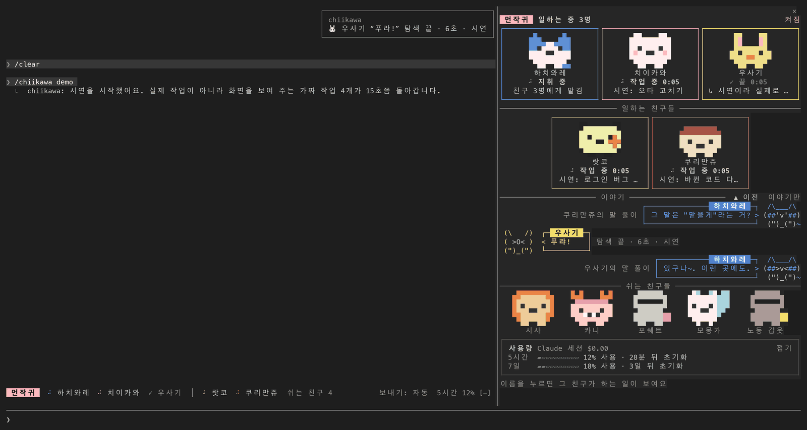
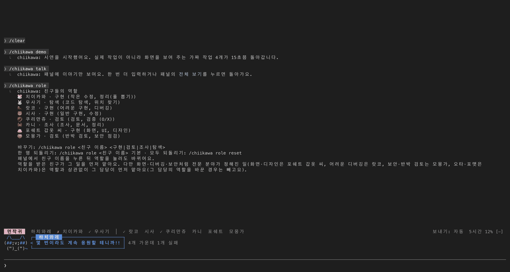
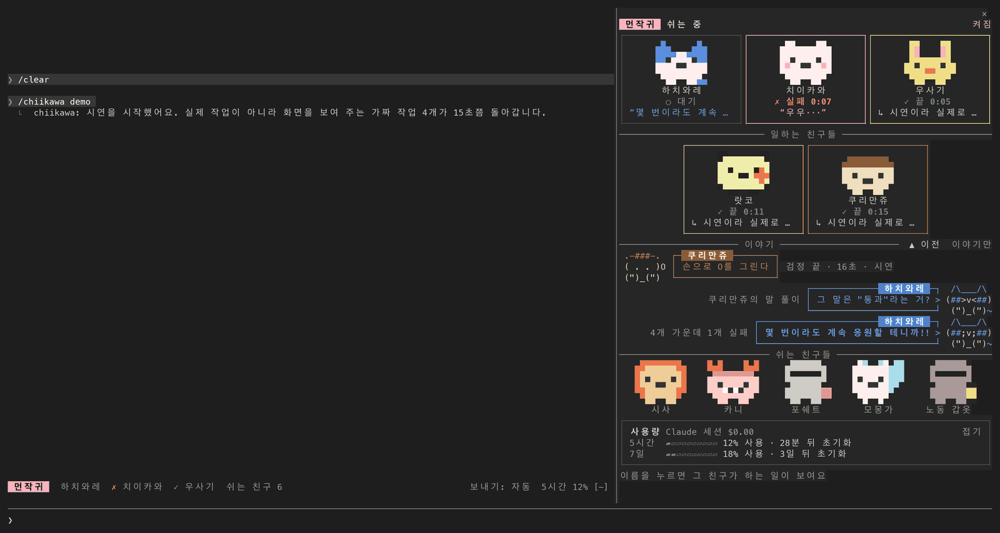
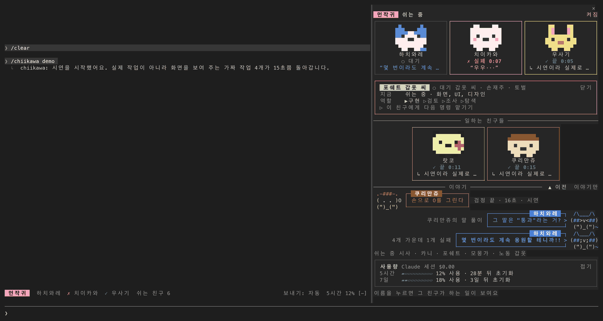
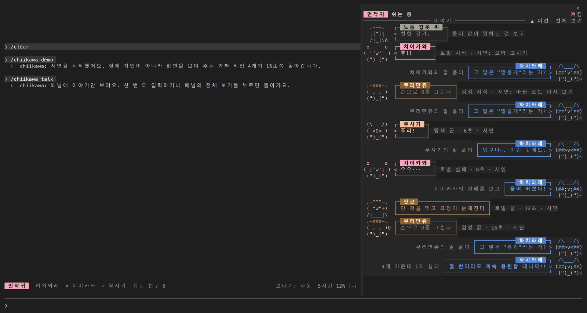
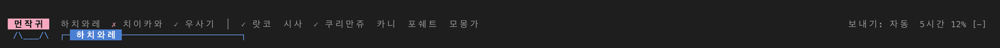

# chiikawa — 치이카와 모드 for Claude Code

[English](README.md) · 한국어 · [日本語](README.ja.md)

Claude Code 안에서 **하치와레가 지휘하고, 치이카와·우사기와 친구들이 일을 맡아 만화처럼 이야기하는** 모드(mod, 플러그인)입니다. 누가 지금 무슨 일을 하는지 캐릭터별 컷과 말풍선으로 보여 줍니다. 만화 《먼작귀(ちいかわ)》의 팬이 만든 **비공식 팬 모드**이고, 원작자 나가노(ナガノ)와 출판사·애니메이션 제작사 등 권리자와 무관하며 승인받은 것이 아닙니다. 공식 그림과 로고는 쓰지 않았고, 화면의 글자 그림과 픽셀 아이콘은 이 모드를 위해 직접 그렸습니다. 영어·한국어·일본어로 동작합니다(기본은 영어, 한국어 사용자에게는 한국어, 일본어 사용자에게는 일본어). 버전 0.2.0.



하치와레에게 "랏코에게 로그인 버그 원인을 찾게 하고, 쿠리만쥬에게 고친 코드 검토를, 카니에게 조사를 맡겨 줘"라고 하면 오른쪽 패널에서 세 친구가 각자 일하는 모습이 보입니다. 다 끝나면 하치와레가 결과를 모아 전합니다. 말을 못 하는 친구(치이카와, 우사기, 쿠리만쥬, 카니)는 소리와 몸짓만 내고, 하치와레가 그 뜻을 풀어 줍니다.

> 스크린샷은 실제 Claude Code 세션(예제 폴더 `hello-app`)의 터미널 출력을 글자와 색 그대로 그림으로 옮긴 것이고, 사용량 숫자는 예시 값입니다. 글꼴과 색은 쓰는 터미널에 따라 조금 다르게 보일 수 있습니다.

## 목차

- [설치 (3분)](#설치-3분)
- [처음 써 보기](#처음-써-보기)
- [친구들과 역할](#친구들과-역할)
- [화면에 보이는 것](#화면에-보이는-것)
- [명령](#명령)
- [설정](#설정)
- [언어](#언어)
- [문제가 생겼을 때](#문제가-생겼을-때)
- [이 모드가 컴퓨터에서 하는 일](#이-모드가-컴퓨터에서-하는-일)
  - [개인정보](#개인정보)
- [AI에게 설치와 사용을 맡기려면](#ai에게-설치와-사용을-맡기려면)
- [Orca fleet-run 연동 (선택)](#orca-fleet-run-연동-선택)
- [개발](#개발)
- [알아 둘 점과 출처](#알아-둘-점과-출처)

## 설치 (3분)

### 준비물

- **Claude Code**: 터미널에서 `claude`로 실행하는 프로그램입니다. 아직 없다면 [Claude Code 소개 페이지](https://claude.com/claude-code)의 안내대로 먼저 설치하세요.
- 이 모드는 Claude Code 2.1.291에서 만들고 시험했습니다. 버전은 `claude --version`으로 확인하고, 오래됐으면 `claude update`로 올립니다.
- 그 밖에 필요한 것은 없습니다. Node.js나 다른 프로그램을 따로 깔지 않습니다.

### 설치하기

1. 터미널을 열고 `claude`를 실행합니다.
2. Claude Code의 입력창에 아래 한 줄을 그대로 붙여 넣고 Enter를 누릅니다.

   ```
   /plugin install chiikawa --marketplace techkwon/chiikawa
   ```

3. 화면이 묻는 대로 답합니다.
   - 마켓플레이스를 추가할지 물으면 수락합니다. 마켓플레이스는 플러그인을 받아 오는 곳(여기서는 이 GitHub 저장소)을 Claude Code에 등록해 두는 것입니다.
   - 설치 범위(scope, 이 모드를 어디에서 쓸지)를 고르는 화면이 나오면 user를 고릅니다. 모든 프로젝트에서 쓰게 됩니다.
   - 설정을 묻는 화면이 나오면 바꿀 것이 없는 한 그대로 넘어갑니다. 나중에 바꿀 수 있습니다.
4. 설치가 끝났다는 줄이 나오면 끝입니다. `/chiikawa`가 바로 보이지 않으면 Claude Code를 다시 시작하세요.

같은 설치를 터미널(Claude Code 밖)에서 두 줄로 할 수도 있습니다.

```
claude plugin marketplace add techkwon/chiikawa
claude plugin install chiikawa@chiikawa
```

설치할 때 설정을 함께 주려면 `--config`를 붙입니다(여러 번 쓸 수 있습니다). 예를 들어 화면을 한국어로 고정하려면 이렇게 합니다.

```
claude plugin install chiikawa@chiikawa --config language=ko
```

### 설치됐는지 확인

터미널에서 `claude plugin list`를 실행해 목록에 `chiikawa@chiikawa`가 있는지 봅니다. 그다음 Claude Code의 입력창에 `/chiikawa`를 입력합니다. 친구들 현황 패널이 열리고 `먼작귀 친구들 현황 패널을 열었어요.`(영어 화면이면 `Opened the friends' status pane.`)라고 나오면 된 것입니다.

### 다른 설치 방법 (저장소를 직접 받아서)

```
git clone https://github.com/techkwon/chiikawa.git
claude --plugin-dir ./chiikawa
```

이 방법은 그 세션에서만 모드를 불러옵니다. 모드를 고쳐 보거나 설치 없이 잠깐 써 볼 때 씁니다.

### 업데이트와 삭제

터미널(Claude Code 밖)에서 실행합니다.

```
claude plugin update chiikawa@chiikawa
claude plugin uninstall chiikawa@chiikawa
```

업데이트는 받은 뒤 Claude Code를 다시 시작해야 적용됩니다. 잠깐만 끄려면 삭제하지 말고 `/chiikawa off`를 쓰세요. `/chiikawa on`으로 다시 켭니다. 켜고 끈 상태는 그 세션의 상태에만 두고 디스크에 저장하지 않으며, 기본값은 켜짐입니다.

`claude plugin uninstall`은 모드만 지웁니다. 아래 세 가지는 따로 지워야 할 수 있습니다. 자세한 내용은 [개인정보](#개인정보)에 있습니다.

- **저장된 역할과 언어**: 모드 폴더가 아니라 Claude Code의 플러그인 저장소에 있습니다. 도움말에 따르면 `claude plugin uninstall`은 `--keep-data`를 붙이지 않는 한 플러그인의 저장 데이터 폴더를 지웁니다. 다만 이 문서는 그때 이 두 값까지 지워진다고 약속하지 않습니다. 확실히 지우려면 삭제하기 전에 Claude Code에서 `/chiikawa role reset`과 `/chiikawa lang auto`를 입력하세요. 맨 마지막에 하세요. 그 뒤에 한글이나 가나로 요청을 입력하면 언어를 다시 기억합니다.
- **마켓플레이스 등록**(모드를 받아 온 곳의 기록): 지우는 명령이 따로 있습니다. `claude plugin marketplace remove chiikawa`.
- **Orca 말투 사본**: Orca를 `orcaVoice`를 켠 채 썼을 때만 있습니다. 작업지시 파일 옆에 있는 `<이름>.chiikawa-<캐릭터>.md` 파일입니다. 모드는 이 파일을 지우지 않습니다. 필요 없는 것은 직접 지우세요.

## 처음 써 보기

아래 문장은 그대로 입력해 볼 수 있습니다.

1. **시연 보기**: 실제로 하는 일 없이, 가짜 작업 4개(우사기의 탐색, 랏코의 토벌, 치이카와의 오타 고치기, 쿠리만쥬의 검토)가 15초쯤 돌면서 화면이 어떻게 움직이는지 보여 줍니다. 치이카와의 일은 일부러 실패로 끝나서, 실패했을 때의 모습도 볼 수 있습니다.

   ```
   /chiikawa demo
   ```

2. **가벼운 일은 셋이 같이**: 평소처럼 부탁합니다. 파일 몇 개를 읽고 조금 고치는 정도의 일은 다른 친구를 부르지 않고 하치와레가 직접 합니다. 이때 화면에는 우사기가 찾고 치이카와가 고치는 것으로 나옵니다.

   ```
   README.md에서 설치 방법이 적힌 곳을 찾아서, 오타가 있으면 고쳐 줘.
   ```

3. **친구를 지명해 나눠 맡기기**: 이름을 넣어 말하면 그 친구에게 맡깁니다. 친구에게 맡긴 일은 서브에이전트(주 세션이 따로 띄우는 보조 AI)가 하고, 그 친구의 말투로 보고합니다.

   ```
   랏코에게 src/index.js의 버그 원인을 찾게 하고, 쿠리만쥬에게는 고친 코드를 검토하게 해 줘.
   ```

   다음 요청 하나를 통째로 한 친구에게 맡기려면 먼저 `/chiikawa 랏코`를 입력하고, 이어서 할 일을 입력합니다.

4. **역할 바꾸기**: 랏코에게 검토를 맡기고 싶으면 아래처럼 입력합니다. 패널에서 친구 이름을 누른 뒤 역할 버튼을 눌러도 됩니다.

   ```
   /chiikawa role 랏코 검토
   ```

5. **이야기만 보기**: 친구들이 주고받은 말만 패널 가득 봅니다. 한 번 더 입력하면 돌아갑니다.

   ```
   /chiikawa talk
   ```

6. **사용량 보기**: 패널의 사용량 카드와 입력창 위 띠에 남은 컨텍스트(이 대화가 한 번에 기억할 수 있는 양)와 요금제 한도가 보입니다. 글로 보려면 `/chiikawa usage`.

7. **언어 바꾸기**: 화면이 원하는 언어가 아니면 아래처럼 고릅니다. `en`은 영어, `ja`는 일본어입니다.

   ```
   /chiikawa lang ko
   ```

친구에게 일을 나눠 맡기면 친구마다 따로 토큰(AI가 읽고 쓰는 글의 양을 세는 단위)을 씁니다. 그래서 모드는 가벼운 일은 직접 하고 노력이 드는 일만 맡기도록 모델에게 지시합니다. 실제로 맡길지는 모델이 요청을 보고 정합니다.

## 친구들과 역할

| 친구 | 표식 | 원작에서 | 기본 역할 | 맡는 일 | 말 |
|---|---|---|---|---|---|
| 하치와레 | 🐱 | 고양이 · 해설 담당 | 지휘 | 일 나누기, 친구들 말 풀어 주기. 주 세션(지금 대화하는 Claude)이 맡음 | 반말 |
| 치이카와 | 🐹 | 햄스터 · 제초 5급 | 구현 | 작은 수정, 정리(풀 뽑기) | 소리와 몸짓만 |
| 우사기 | 🐰 | 토끼 · 제초 2급 | 탐색 | 코드 탐색, 위치 찾기 | 소리만 |
| 랏코 | 🦦 | 해달 · 토벌 랭킹 1위 | 구현 | 어려운 구현, 디버깅 | 짧고 단정한 반말 |
| 시사 | 🦁 | 시사 · 슈퍼 아르바이터 | 구현 | 일반 구현, 수정 | 존댓말 |
| 쿠리만쥬 | 🌰 | 밤만쥬 · 선배 | 검토 | 검토, 검증 (O/X) | 손으로 O, X |
| 카니 | 🦀 | 헌책방 주인 | 조사 | 조사, 문서, 정리 | 표정과 몸짓만 |
| 포쉐트 갑옷 씨 | 👛 | 갑옷 씨 · 손재주 | 구현 | 화면, UI, 디자인 | 상냥한 말투 |
| 모몽가 | 🍑 | 하늘다람쥐 · 트집쟁이 | 검토 | 반박 검토, 보안 점검 | 건방진 반말 |
| 노동 갑옷 씨 | 🔔 | 갑옷 씨 · 노동 접수 | (일을 맡지 않음) | 일감 접수 알림, 수상한 일 경고 | 혼잣말 |

"맡는 일"은 원작의 설정이 아니라 이 모드가 정한 배역입니다. 이름과 "원작에서" 칸의 말은 언어마다 다르게 나옵니다([언어](#언어) 절의 표).

누가 맡을지는 이렇게 정합니다.

1. **이름을 지정했으면 그 친구.** 요청에 이름을 넣어 말하거나 `/chiikawa 랏코`로 골라 둔 경우입니다.
2. **전문 분야가 있으면 그 담당.** 보안·반박 검토는 모몽가, 화면·UI·디자인은 포쉐트 갑옷 씨, 어려운 디버깅과 원인 찾기는 랏코, 오타·포맷·이름 바꾸기 같은 잔손질은 치이카와가 먼저 맡습니다. 둘에 걸치면 앞의 것이 이깁니다(화면의 보안 점검은 모몽가). 구현 일을 작은 모델(haiku)로 요청한 경우에도 치이카와가 먼저 맡습니다.
3. **그 밖에는 역할의 담당 순서대로.** 일의 종류(구현·검토·조사·탐색)는 서브에이전트의 종류와 설명에 든 낱말로 가늠하고, 가늠할 낱말도 전문 분야도 없으면 구현으로 봅니다. 구현은 시사 → 랏코 → 포쉐트 갑옷 씨 → 치이카와, 검토는 쿠리만쥬 → 모몽가 → 랏코, 조사는 카니 → 시사 → 우사기, 탐색은 우사기 → 카니 → 치이카와 순서이고, 앞 친구가 바쁘면 손이 빈 다음 친구가 맡습니다.

알아 둘 것:

- **말을 못 하는 친구**(치이카와, 우사기, 쿠리만쥬, 카니)는 원작처럼 문장으로 말하지 않습니다. 보고의 첫 줄에 `“후!!”`, `“우라”`, `(손으로 O를 그린다)` 같은 소리나 몸짓 하나만 쓰고, 둘째 줄부터는 평범한 글로 보고합니다. 하치와레가 `그 말은 "다 됐어"라는 거?`처럼 뜻을 풀어서 전합니다.
- 말투는 **보고하는 글에만** 입힙니다. 코드, 명령, 커밋 메시지, 파일 내용에는 넣지 않도록 지시합니다.
- 화면에는 원작의 일 이름이 나옵니다. 구현과 버그 잡기는 **토벌**, 검토는 **검정**, 조사는 **채집**, 정리는 **풀 뽑기**, 토큰 사용량은 **보수**입니다.
- Claude Code의 포크(fork), Agent Teams의 팀원, `codex:`로 시작하는 서브에이전트는 배정하지 않고 그대로 둡니다.

역할은 바꿀 수 있습니다. 패널이나 띠에서 친구 이름을 누르면 나오는 시트의 `역할` 줄에서 구현·검토·조사·탐색 가운데 하나를 누르거나, `/chiikawa role 랏코 검토`처럼 입력합니다.



- 역할을 받은 친구는 그 역할의 일을 원래 담당들보다 **먼저** 맡고, 자기의 원래 역할 순서에서는 빠집니다. 다른 친구와 맞바꾸는 것이 아니라서 여러 친구가 같은 역할을 가질 수 있습니다.
- **전문 분야가 역할보다 먼저입니다.** 역할을 바꿔도 위 2번의 전문 분야 일(화면·디자인은 포쉐트 갑옷 씨, 어려운 디버깅은 랏코, 보안·반박 검토는 모몽가, 오타·포맷은 치이카와)은 그 담당이 먼저 맡습니다. 다만 그 담당 자신의 역할을 바꿨다면 그 친구는 전문 분야에서도 빠집니다. 역할을 바꾸면 명령의 답이 이 점을 함께 알려 줍니다.
- 바꾼 역할은 다음 작업부터 적용되고 다음 세션에도 남습니다(저장하지 못했으면 그 세션에만 적용된다고 답에 나옵니다). `/chiikawa role 랏코 기본`으로 한 명을, `/chiikawa role reset`으로 모두를 원래대로 돌립니다.
- 하치와레의 지휘는 바꿀 수 없고, 노동 갑옷 씨는 일을 맡지 않아 역할이 없습니다.

## 화면에 보이는 것

### 오른쪽 패널



위에서부터 이렇게 놓입니다.

- **제목 줄**: `먼작귀` 옆에 지금 상태(`일하는 중 2명`, `셋이 같이 하는 중`, `기다리는 친구 1명`, `쉬는 중`)가 나옵니다.
- **핵심 3명**: 하치와레·치이카와·우사기의 컷은 항상 맨 위에 있습니다. 컷마다 픽셀 아이콘, 이름, 상태, 그리고 지금 하는 일이나 마지막 대사 한 줄이 들어갑니다.
- **일하는 친구들**: 다른 친구는 일을 맡았을 때만 같은 모양의 컷으로 나오고, 일이 끝나고 30초쯤 지나면 대기석으로 돌아갑니다.
- **이야기**: 친구들의 대사가 말풍선 컷으로 쌓입니다. 친구는 왼쪽에, 대답하는 하치와레는 오른쪽에 그려집니다. 대사는 둥근 말풍선, 몸짓은 네모 상자입니다. 기본은 3컷이고 자리가 남으면 8컷까지 늘어납니다. `▲ 이전`·`▼ 다음`을 누르면 지난 이야기(120줄까지 보관)를 넘겨 봅니다.
- **쉬는 친구들(대기석)**: 일이 없는 친구가 아이콘과 이름으로 앉아 있습니다. 이번에 일을 끝낸 친구는 이름 옆에 `✓`나 `✗`가 붙습니다.
- **사용량 카드**: **배터리**는 이 대화의 컨텍스트 창이 **남은** 비율이고, **5시간·7일**은 요금제 한도를 **쓴** 비율과 초기화까지 남은 시간입니다. 그 아래 `친구별 보수`는 이번 세션에서 친구마다 쓴 토큰(입력·캐시·출력)을 누적한 것입니다. 작업 기록과 따로 세기 때문에 `/chiikawa clear`로 기록을 지워도 남고, `/chiikawa clear all`로 지웁니다. `접기`를 누르면 한 줄로 줄어들고, 그 줄을 누르면 다시 펼쳐집니다.

상태는 `● 작업 중 0:12`(일하는 동안에는 표시가 돕니다), `◐ 기다리는 중`, `✓ 끝`, `✗ 실패`, `○ 대기`로 나옵니다. 가벼운 일을 셋이 같이 할 때는 하치와레가 `같이 하는 중`, 치이카와와 우사기가 `거드는 중`입니다.

패널이 넉넉하면(폭 50칸, 높이 17줄 이상) 위와 같은 컷 화면으로, 그보다 작으면 친구마다 두 줄짜리 목록으로 그립니다. 패널이 아무리 넓어도 84칸까지만 씁니다.

### 친구 시트



패널이나 띠에서 친구 이름을 누르면 그 친구의 시트가 열립니다. 같은 이름을 다시 누르거나 `닫기`를 누르면 닫힙니다.

- `지금`: 맡은 일의 이름, 어떤 서브에이전트(또는 Orca 프로필)인지, 걸린 시간, 지금 쓰는 도구(`▸ Read index.js · 도구 3회`처럼).
- `끝낸 일`과 `보고`: 가장 최근에 끝낸 일과, 돌려준 보고의 앞 6줄까지.
- `보수`와 `한 말`: 그 친구가 쓴 토큰, 최근에 한 말 두 가지.
- `역할`: 누르면 그 역할로 바뀝니다. 지금 역할 앞에 `▶`가 붙습니다.
- `▷ 이 친구에게 다음 명령 맡기기`: 누르면 다음에 입력하는 요청 하나를 그 친구가 맡습니다. 한 번 더 누르면 취소됩니다. 하치와레의 시트에서는 `▷ 다음 명령은 하치와레가 직접 하기`입니다.
- 패널이 낮거나 좁으면 시트는 이 순서로 덜어 냅니다: 위의 내용 줄(아래쪽 줄부터), 역할 단추(이름을 줄여 보다가 뺍니다), 맡기기 단추. 이름과 `닫기`는 끝까지 남습니다.

### 이야기만 보기



이야기 줄 끝의 `이야기만`을 누르거나 `/chiikawa talk`를 입력하면 패널 전체를 이야기로 채웁니다. `전체 보기`를 누르거나 `/chiikawa talk`를 한 번 더 입력하면 돌아갑니다. 패널 폭이 50칸보다 좁으면 컷 대신 한 줄에 대사 하나씩 보여 줍니다.

### 입력창 위 띠



- **친구 이름**: 핵심 3명이 먼저, 그 뒤로 다른 친구가 나옵니다. 이름을 누르면 패널에 그 친구의 시트가 열립니다. 일을 맡은 친구는 이름 앞에 상태 표시가, 뒤에 걸린 시간이 붙습니다.
- **`보내기: 자동`**: 다음 요청을 누가 받는지입니다. 기본은 자동(하치와레가 나눠 맡김)이고, 친구를 골라 두면 `보내기: 랏코`로 바뀌며 그 친구 이름 앞에 `▶`가 붙습니다. 누르면 지명이 풀립니다.
- **사용량**: `배터리 82% · 5시간 12%`처럼 나옵니다. 누르면 패널이 사용량을 펼친 채 열립니다.
- **마지막 대사 한 컷**: 패널이 닫혀 있고 이야기가 오가는 동안(일하는 중이거나 마지막 대사 뒤 45초쯤)에는 띠 아래에 마지막 대사가 컷 하나로 나옵니다. 패널이 열려 있으면 띠는 한 줄만 남습니다.
- 폭이 모자라면 걸린 시간, 사용량의 5시간 수치, 쉬는 친구 이름(`쉬는 친구 4`처럼 숫자로 줄고, 누르면 패널이 열립니다), 일하는 친구 이름, `보내기`, 사용량 순으로 줄어듭니다.

### 그 밖에

- **스피너 문구**: 기다리는 동안 `🐱 하치와레 궁리하는 중`, `🐱 하치와레 지휘 중`처럼 나옵니다.
- **턴이 끝난 뒤 한 줄**: 하치와레의 한마디(`“최고~”` 또는 `“그치! 틀림없지!”`)와 걸린 시간이 나옵니다. 10분을 넘긴 턴에는 `“몇 번이라도 계속 응원할 테니까!!”`입니다.
- **알림**: 친구의 일이 끝나면 그 친구의 한마디와 결과(`토벌 끝 · 12초`처럼)가 알림으로 뜹니다.
- **순간 대사**: 그런 순간이 오면 이야기에 나옵니다. 새 일감이 걸리면 노동 갑옷 씨 “빠른 사람이 임자!”, 두 친구가 같이 일하게 되면 노동 갑옷 씨 “친한 건가.”, 일이 3분을 넘기면 그 친구의 한마디와 함께 손이 빈 모몽가 “배고파서 기분이 좀 안 좋아!!!”, 친구의 도구 사용이 거절되면 노동 갑옷 씨 “의태형인가...?”, 치이카와의 일이 실패하면 하치와레 “울어 버렸다!”, 여러 일이 한꺼번에 잘 끝나면 하치와레 “간단!! 간단!!!”.
- **움직임**: 일하는 친구의 글자 그림은 걷고 아이콘은 통통 뜁니다. 아무도 일하지 않는 동안에는 그림을 움직이지 않습니다.
- **밝은 화면·어두운 화면**: Claude Code 테마 이름에 `light`가 들어 있으면 밝은 배경에서 읽히는 진한 색으로 그립니다. 테마를 바꾸면 다음 요청을 보내거나 `/chiikawa`를 실행할 때 따라갑니다. 맞지 않으면 설정의 "Color theme"을 `light`나 `dark`로 고정하세요.

## 명령

| 입력 | 하는 일 |
|---|---|
| `/chiikawa` | 친구들 현황 패널을 열고, 현황과 최근 이야기를 글로도 보여 줍니다 |
| `/chiikawa demo` | 가짜 작업 4개를 15초쯤 돌려 화면을 보여 줍니다. 실제로 하는 일은 없습니다. 모드가 켜져 있을 때만 됩니다 |
| `/chiikawa on` · `/chiikawa off` | 모드를 켜고 끕니다. 끄면 말투 지시가 멈추고, 띠와 스피너 문구, 턴이 끝난 뒤의 한 줄을 더는 그리지 않습니다. 이미 열려 있는 패널은 닫히지 않고, 제목 줄 오른쪽에 `꺼짐`이라고 표시된 채 남습니다. 이미 맡긴 일은 꺼 둔 동안에도 끝나면 완료와 사용량을 정리하되(Orca 작업자의 결과는 다시 켠 뒤에 읽습니다), 알림과 이야기 줄은 내지 않습니다 |
| `/chiikawa usage` | 사용량(컨텍스트, 한도, 비용, 친구별 토큰)을 글로 보여 줍니다 |
| `/chiikawa talk` | 패널을 이야기만 보기로 바꿉니다. 한 번 더 입력하면 전체 보기로 돌아갑니다 |
| `/chiikawa 랏코` (친구 이름) | 다음에 입력하는 요청 하나를 그 친구에게 맡깁니다. 같은 이름을 다시 입력하면 취소됩니다. `/chiikawa 하치와레`는 맡기지 않고 하치와레가 직접 처리 |
| `/chiikawa auto` | 지명을 풀고 보내기를 자동(기본)으로 돌립니다 |
| `/chiikawa role` | 친구들의 역할을 글로 보여 줍니다 |
| `/chiikawa role 랏코 검토` | 랏코에게 검토를 맡깁니다. 역할: 구현·검토·조사·탐색(토벌·검정·채집으로 적어도 됩니다) |
| `/chiikawa role 랏코 기본` · `/chiikawa role reset` | 한 명 또는 모두의 역할을 원래대로 돌립니다 |
| `/chiikawa lang` | 지금 언어와, 그 언어가 무엇으로 정해졌는지 보여 줍니다 |
| `/chiikawa lang ko` (`en` · `ja`) | 언어를 고릅니다. 다음 세션에도 남습니다(저장하지 못했으면 그 세션에만 적용된다고 답에 나옵니다) |
| `/chiikawa lang auto` | 고른 언어와, 입력한 글자로 기억해 둔 언어를 모두 지우고 자동으로 정하게 합니다 |
| `/chiikawa clear` | 끝난 작업 기록과 이야기를 지웁니다. 진행 중인 작업과 친구별 보수(누적 사용량)는 남습니다 |
| `/chiikawa clear all` | 진행 중으로 남아 있던 작업까지 모든 작업 기록과 이야기, 친구별 보수(누적 사용량)를 지웁니다 |

- 친구 이름과 역할 이름은 세 언어 어느 것으로 적어도 알아듣고, 영문은 대문자·소문자를 가리지 않습니다(`랏코`·`rakko`·`ラッコ`, `검토`·`review`·`レビュー`). 카니는 `kani`·`furuhonya`·`헌책방`·`古本屋`로, 포쉐트 갑옷 씨는 `포쉐트`·`포셰트`·`pochette`·`ポシェット`로 불러도 됩니다. 한국 정발판의 이름(토끼, 해달, 밤만쥬, 하늘다람쥐)도 알아듣습니다. 하치와레는 `하치와레`·`hachiware`·`ハチワレ`로만 알아듣습니다(정발판 이름은 안 됩니다).
- 골라 둔 친구는 **다음 요청 하나**에만 쓰이고, 그 요청이 들어가면 다시 자동으로 돌아갑니다. `/`로 시작하는 슬래시 명령에는 붙지 않고 그다음의 보통 요청을 기다립니다.

## 설정

설치할 때 묻는 화면에서 정하고, 나중에는 입력창에 `/plugin configure chiikawa@chiikawa`를 입력해 바꿉니다. 설정 화면의 제목은 영어로 나옵니다. 바꾼 설정이 바로 보이지 않으면 Claude Code를 다시 시작하세요.

| 항목 | 화면의 제목 | 기본값 | 하는 일 |
|---|---|---|---|
| `language` | Language | `auto` | 값을 글자로 적습니다. `auto` · `en` · `ko` · `ja`. `auto`는 [언어](#언어) 절의 순서로 정합니다. 그 밖의 글자는 `auto`로 다룹니다 |
| `leaderVoice` | Hachiware's voice | 켬 | 주 세션이 지휘자 하치와레 말투로 말함. 끄면 지휘 안내를 시스템 프롬프트에도 요청 옆에도 붙이지 않고, `[치이카와 역할]` 줄도 붙이지 않음. 나머지는 그대로 남음: 화면 표시, 배역(서브에이전트의 설명, 결과 뒤의 `[치이카와 배역]` 줄), 서브에이전트의 캐릭터 말투(`memberVoice`), Orca 말투 사본(`orcaVoice`), 친구를 골랐을 때의 `[치이카와 지명]` 줄 |
| `politeLeader` | Polite Hachiware | 끔 | 하치와레가 원작처럼 반말을 쓰는 대신 존댓말로 말함 |
| `memberVoice` | The friends' voices | 켬 | 서브에이전트가 배역을 맡은 캐릭터 말투(말 못 하는 친구는 소리)로 보고함 |
| `orcaVoice` | Orca workers' voices | 켬 | `fleet-run` 작업지시 옆에 캐릭터 말투를 붙인 사본을 만들어 넘김 (Orca를 쓸 때만 해당) |
| `band` | Band of friends above the prompt | 켬 | 입력창 위에 친구 이름, 보내기, 사용량을 한 줄로 보여 주고, 패널이 닫혀 있을 때만 마지막 대사 한 컷을 그 아래에 보여 줌 |
| `trio` | The three together | 켬 | 주 세션이 직접 하는 가벼운 일을 하치와레·치이카와·우사기가 같이 하는 것으로 보여 줌(찾는 도구는 우사기, 고치는 도구는 치이카와) |
| `animate` | Movement while working | 켬 | 일하는 캐릭터의 그림과 아이콘이 0.5초마다 움직임(상태 표시도 같이 돎). 끄면 이 0.5초 움직임만 없어짐. 무언가 바뀔 때(일이 시작되거나 끝날 때, 도구를 쓸 때, 무언가를 누를 때)와 2초마다 도는 확인 때는 화면을 그대로 다시 그림 |
| `theme` | Color theme | `auto` | 값을 글자로 적습니다. `auto`(Claude Code 테마를 따름) · `dark` · `light`. 그 밖의 글자는 `auto`로 다룹니다 |
| `autoOpen` | Open the pane by itself | 켬 | 친구에게 일이 맡겨지면 패널을 스스로 엶(터미널 폭 144칸 이상일 때). 손으로 닫으면 `/chiikawa` 전까지 다시 열지 않음 |

## 언어

화면의 글, 명령의 답, 캐릭터 이름과 대사, 모델에게 주는 안내가 한 언어로 맞춰집니다. 영어·한국어·일본어 가운데 하나이고, 아래 순서에서 먼저 해당하는 것으로 정합니다.

1. 모드 설정 `language`가 `en`·`ko`·`ja`이면 그 언어로 고정합니다.
2. `/chiikawa lang <en|ko|ja>`로 고른 언어. 저장되면 다음 세션에도 남습니다.
3. 입력한 프롬프트의 글자. 한글이 있으면 한국어, 가나가 있으면 일본어입니다(둘 다 있으면 많은 쪽). 영어 글자나 한자만 있는 프롬프트와 `/`로 시작하는 명령은 언어를 바꾸지 않습니다. 한글이나 가나가 2자 이상일 때만 바꾸고, 글자 때문에 언어가 바뀌면 알림(토스트)으로 알려 주고 되돌리는 명령도 함께 보여 줍니다(모드가 켜져 있을 때). 이렇게 정해진 언어도 저장되면 다음 세션에 기억됩니다.
4. Claude Code의 언어 설정(한국어·일본어·영어일 때).
5. 환경 변수 `LC_ALL`, `LC_MESSAGES`, `LANG` 가운데 먼저 값이 있는 것.
6. 아무것도 해당하지 않으면 영어.

- `/chiikawa lang`은 지금 언어와 위의 어느 것으로 정해졌는지를 알려 줍니다. `/chiikawa lang auto`는 2번에서 고른 값과 3번에서 글자로 기억한 값을 모두 지웁니다.
- 한 번 한국어로 바뀐 뒤에는 영어로만 입력해도 영어로 돌아가지 않습니다(영어 글자는 언어를 바꾸지 않기 때문입니다). 영어로 돌리려면 `/chiikawa lang en`을 씁니다. `/chiikawa lang auto`는 다릅니다. 언어를 위 3~6번으로 다시 정하게 하므로, Claude Code의 언어 설정이나 로캘이 한국어·일본어이면 화면이 다시 한국어·일본어가 됩니다.
- **저장**: 언어(고른 것, 글자로 정해진 것)와 바꾼 역할은 저장에 성공했을 때만 다음 세션으로 이어집니다. 저장하지 못하면 그 세션에만 적용된다고 답에 나옵니다. 글자 때문에 언어가 바뀐 경우에는 알림(토스트)에 그렇게 나오고, 다음 요청을 보낼 때 다시 저장해 봅니다. 저장된 값을 읽지 못한 세션에서는, 남아 있는 값을 덮어쓰지 않으려고 역할도 언어도 저장하지 않고 똑같이 "이번 세션에만"이라고 알려 줍니다.
- **언어가 바뀌면 이야기도 따라 바뀝니다**: 모드가 지은 글(캐릭터 대사, 하치와레의 풀이, 몇 개가 끝났는지 같은 설명)은 이미 이야기에 쌓인 줄까지 새 언어로 보입니다. 사람이나 다른 AI가 쓴 글은 쓴 그대로 둡니다. 작업 제목, 도구의 대상(파일 이름, 명령 첫머리), 보고의 줄이 그렇습니다. 말을 못 하는 친구가 보고 첫 줄에 쓴 소리나 몸짓은, 글자 그대로 그 친구의 것이고 다른 언어에 바로 그 줄이 있을 때만 바꿔 보여 줍니다.
- **`/clear` 뒤**: 저장된 언어와 역할은 모드를 처음 쓰는 순간(요청 보내기, `/chiikawa`, 띠나 패널 누르기)이나 2초마다 도는 확인 가운데 먼저 오는 때에 다시 읽습니다. 그 전 잠깐은 화면이 영어와 기본 역할로 보일 수 있습니다.
- 설정 `language`가 고정되어 있으면 `/chiikawa lang`으로 고른 값은 기억만 해 두고 화면은 그대로입니다. 설정을 `auto`로 돌리면 쓰입니다.
- 언어가 바뀌면 다음 요청 옆에 새 언어의 지휘 안내가 한 번 더 붙습니다. 이미 나온 이야기는 나온 언어 그대로 남습니다.
- 모드의 언어는 화면과 캐릭터 말투만 정합니다. 답하는 언어를 따로 지시해 두었다면(CLAUDE.md 등) 그 지시가 우선하도록 모델에게 안내합니다.

언어마다 이름이 다릅니다. 명령에서는 어느 언어의 이름으로 불러도 됩니다.

| 표식 | 한국어 | 日本語 | English |
|---|---|---|---|
| 🐱 | 하치와레 | ハチワレ | Hachiware |
| 🐹 | 치이카와 | ちいかわ | Chiikawa |
| 🐰 | 우사기 | うさぎ | Usagi |
| 🦦 | 랏코 | ラッコ | Rakko |
| 🦁 | 시사 | シーサー | Shisa |
| 🌰 | 쿠리만쥬 | くりまんじゅう | Kurimanju |
| 🦀 | 카니 | 古本屋 | Furuhonya |
| 👛 | 포쉐트 갑옷 씨 | ポシェットの鎧さん | Pochette no Yoroi-san |
| 🍑 | 모몽가 | モモンガ | Momonga |
| 🔔 | 노동 갑옷 씨 | 労働の鎧さん | Roudou no Yoroi-san |

| 역할 | 한국어 (원작의 일 이름) | 日本語 | English |
|---|---|---|---|
| 지휘 | 지휘 | 指揮 | Lead |
| 구현 | 구현 (토벌) | 実装 (討伐) | Build (Hunt) |
| 검토 | 검토 (검정) | レビュー (検定) | Review (Exam) |
| 조사 | 조사 (채집) | 調査 (採取) | Research (Forage) |
| 탐색 | 탐색 | 探索 | Explore (Scout) |

대사도 언어마다 다릅니다. 한국어판에는 일본어판·영어판에 없는 대사가 있습니다. 까닭은 [알아 둘 점과 출처](#알아-둘-점과-출처)에 적었습니다.

## 문제가 생겼을 때

| 증상 | 해 볼 것 |
|---|---|
| `/plugin install …`을 쓸 수 없다고 나옴 | 터미널에서 실행한 Claude Code의 입력창인지 확인하세요. 그래도 안 되면 터미널(Claude Code 밖)에서 `claude plugin marketplace add techkwon/chiikawa`와 `claude plugin install chiikawa@chiikawa` 두 줄로 설치합니다 |
| 마켓플레이스를 찾지 못한다고 나옴 | 저장소 주소가 `techkwon/chiikawa`인지 확인하세요 |
| `/chiikawa`가 없다고 나옴 | 터미널에서 `claude plugin list`를 실행해 `chiikawa@chiikawa`를 찾습니다. 목록에 없으면 설치가 안 된 것이니 설치합니다. 목록에 있는데 `Status`가 disabled이면 `claude plugin enable chiikawa@chiikawa`를 실행한 뒤 Claude Code를 다시 시작합니다. 목록에 있고 enabled이면 Claude Code를 다시 시작합니다. Claude Code가 오래됐으면 `claude update` |
| 화면의 언어가 원하는 것과 다름 | 먼저 `/chiikawa lang`을 입력해 언어가 무엇으로 정해졌는지 봅니다. 모드 설정(`language`)으로 정해 두었다고 나오면 `/chiikawa lang <en\|ko\|ja>`로는 화면이 바뀌지 않습니다. `/plugin configure chiikawa@chiikawa`를 입력해 `language`를 원하는 언어나 `auto`로 바꿉니다. `language`가 `auto`이면 `/chiikawa lang <en\|ko\|ja>`로 고릅니다. 항상 한 언어로 두려면 설정의 `language` 항목에 `en`·`ko`·`ja`를 적습니다 |
| 패널이 스스로 안 열림 | 터미널 폭이 144칸보다 좁으면 스스로는 열지 않습니다. 손으로 닫은 뒤에도 다시 열지 않습니다. `/chiikawa`를 입력하면 폭과 상관없이 열립니다 |
| 그림이 작거나, 컷 없이 글자 목록만 나옴 | 패널이 작을 때의 모양입니다. 터미널 창을 키우면(패널 폭 50칸, 높이 17줄 이상) 컷과 아이콘이 나옵니다 |
| 색이 흐리거나 안 읽힘 | 설정의 "Color theme"을 쓰는 테마에 맞춰 `light`나 `dark`로 고정합니다 |
| 말투가 일할 때 방해됨 | `/chiikawa off`로 끄거나, 설정에서 말투만 끕니다. `leaderVoice`와 `memberVoice`를 끄고, Orca를 쓰면 `orcaVoice`도 끕니다(화면 표시는 남음). 끈 뒤에 맡기는 일부터 적용됩니다. 이미 말투 지시를 받은 서브에이전트와 Orca 작업자는 그 일이 끝날 때까지 그대로 말하고, 이미 만든 말투 사본도 남습니다. 반말이 불편하면 `politeLeader`를 켭니다 |
| 입력창 위 띠가 자리를 많이 차지함 | 패널을 열어 두면(`/chiikawa`) 띠는 한 줄만 남습니다. 아예 없애려면 설정에서 `band`를 끕니다 |
| 움직임이 거슬리거나 화면이 자주 깜빡임 | 설정에서 `animate`를 끕니다 |
| 내가 맡기지 않았는데 치이카와·우사기가 일한 것으로 나옴 | 주 세션이 직접 한 일을 셋이 같이 한 것으로 보여 주는 기능입니다. 싫으면 설정에서 `trio`를 끕니다 |
| 친구가 "기다리는 중"으로 오래 남음 | Orca 작업자의 결과 파일을 찾지 못한 경우입니다. 그 친구 이름을 눌러 시트의 안내를 보고 결과 파일을 직접 확인하세요. 결과가 끝내 없으면 한두 시간 뒤 모드가 스스로 내려놓습니다. 바로 지우려면 `/chiikawa clear all` |

그래도 안 되면 `claude --debug`로 실행했을 때 나오는 오류 줄과 `claude --version`의 결과를 [이슈](https://github.com/techkwon/chiikawa/issues)에 적어 주세요. 개인 정보나 키 값은 지우고 올려 주세요.

## 이 모드가 컴퓨터에서 하는 일

모드는 샌드박스 없이 사용자 권한으로 돕니다. 그래서 무엇을 읽고, 실행하고, 쓰고, 남기고, 바꾸는지 전부 적어 둡니다.

### 개인정보

- **만든 사람은 아무 데이터도 받지 않습니다.** 이 모드에는 네트워크 호출도, 분석 수집도, 원격 서버도 없고, 다른 프로그램도 실행하지 않습니다. 모드가 읽은 것을 모드가 컴퓨터 밖으로 보내는 일은 없습니다.
- **세션 상태에만 있는 것**: 작업 기록(누가 무엇을 맡았는지, 화면에 보이는 도구 대상인 파일 이름이나 명령의 첫머리, 보고마다 6줄까지), 이야기(120줄까지), 사용량 숫자, 골라 둔 친구, 켜고 끈 상태. 모드는 이것들을 파일로 쓰지 않고, 새 세션은 이것 없이 시작합니다. 세션 도중에 지우려면 `/chiikawa clear all`로 작업 기록과 이야기, 친구별 보수를 한 번에 지웁니다. 세션 상태는 같은 세션의 다른 플러그인이 읽을 수 있습니다.
- **디스크에 남는 것**: 두 가지뿐입니다.
  - 바꾼 역할과 언어(고른 언어, 입력한 글자로 기억한 언어). Claude Code의 플러그인 저장소에 남습니다. 입력한 글은 들어 있지 않습니다. 지울 때까지 남고, `/chiikawa role reset`으로 역할을, `/chiikawa lang auto`로 언어를 지웁니다.
  - Orca 말투 사본(`<이름>.chiikawa-<캐릭터>.md`). Orca를 `orcaVoice`를 켠 채 쓸 때만 작업지시 파일 옆에 생깁니다. 사본은 작업지시 전체를 담고, 개인정보를 거르는 장치는 없습니다. 모드는 사본을 지우지 않으므로, 파일을 직접 지울 때까지 남습니다.
- **모델과 다른 AI 작업자에게 가는 것**
  - 모드가 덧붙이는 글(시스템 프롬프트의 절, 프롬프트 옆의 안내, 서브에이전트 지시 끝의 배역 블록, 도구 결과 뒤의 한 줄)은 사용자의 프롬프트와 같은 길로 모델에 전달됩니다.
  - Orca 말투 사본은 그 작업자(다른 AI)가 읽습니다. 작업지시에 민감한 내용이 있으면 사본을 통해서도 그 작업자에게 갑니다.

### 하나씩 자세히

- **실행하는 프로그램**: 없습니다. 다른 프로그램이나 셸 명령을 실행하지 않습니다.
- **읽는 것**
  - 서브에이전트의 종류와 설명(description), 요청한 모델 이름, 지시 글(끝에 배역 블록을 붙이려고 읽으며, 저장하지 않습니다), 도구 호출의 이름과 대상(파일 이름, 또는 명령·검색어의 앞 48자), 서브에이전트가 돌려준 보고(글 전체를 읽고, 내용이 있는 앞 6줄까지만 줄마다 160자로 잘라 보관합니다), 쓴 토큰 수.
  - 주 세션이 직접 쓰는 도구의 이름과 대상, 턴마다 쓴 토큰 수. Bash 명령은 그 안에 `fleet-run`이 있는지 보고, 있을 때만 명령을 읽어 실행과 경로를 찾습니다.
  - 입력한 프롬프트는 `/`로 시작하는지와, 언어를 가늠하려고 한글·가나 글자의 수(앞 2,000자까지)만 봅니다. 글 자체는 저장하지 않습니다.
  - 세션의 사용량 숫자(컨텍스트, 요금제 한도, 비용), 진행 중인 서브에이전트 목록, 열려 있는 패널 목록, Claude Code 설정 목록(그 가운데 테마 이름과 언어만 씁니다).
  - 환경 변수는 `HOME`(명령 속 `~` 경로 풀기)과 `LANG`·`LC_ALL`·`LC_MESSAGES`(언어 가늠) 넷만 읽습니다. 자격 증명이나 키는 읽지 않습니다.
  - 파일은 Orca `fleet-run`을 실행할 때만 읽고, 읽을 때는 파일 전체를 읽습니다: 작업지시 파일(`--spec`, `orcaVoice`를 켰을 때만), 결과 파일(`--out`), 그 옆의 `<out>.meta.json`, 그리고 말투 사본이 놓일 자리에 이미 있는 파일(덮어쓰지 않으려고 내용을 견줍니다). 4MiB가 넘는 파일은 읽지 않습니다(Claude Code가 그런 읽기를 거절합니다). 결과 파일에서 보관하는 것은 보고로 보여 줄, 내용이 있는 앞 6줄(줄마다 160자)까지입니다. 작업지시의 글은 말투 사본에 들어갈 뿐, 다른 곳에 보관하지 않습니다.
- **쓰는 파일**: 한 종류뿐입니다. Orca `fleet-run`을 실행할 때 작업지시 파일 옆에 캐릭터 말투 지시를 덧붙인 사본 `<이름>.chiikawa-<캐릭터>.md`를 만듭니다(캐릭터 자리에는 `rakko` 같은 영문 이름이 들어갑니다). 원본은 건드리지 않습니다. 쓰기 전에 그 자리에 파일이 있는지 먼저 보고, 있으면 쓰지 않습니다. 쓴 뒤에는 사본을 다시 읽어, 내용이 쓴 것과 다르면 그 사본을 쓰지 않고 원래 작업지시로 실행합니다. 막지 못하는 경우가 하나 있습니다. 확인과 쓰기 사이의 아주 짧은 순간에 다른 프로그램이 같은 이름의 파일을 만들면 그 파일은 덮어쓰입니다. `orcaVoice`를 끄면 만들지 않습니다.
- **남기는 설정**: Claude Code의 플러그인 저장소(`$.store`)에 두 가지를 남깁니다. 바꾼 역할(`roles`)과 언어(`lang`: `/chiikawa lang`으로 고른 값, 입력한 글자로 기억한 값). 그 밖의 것(작업 기록, 이야기, 사용량 숫자, 켜고 끈 상태)은 세션 상태에만 있습니다.
- **바꾸는 것**
  - 시스템 프롬프트에 "치이카와 모드" 절을 하나 붙입니다(`prompt.compose`).
  - 사용자가 입력한 요청 옆에 안내를 덧붙입니다(`prompt.submit`): 세션의 첫 요청, 대화 요약 직후의 요청, 언어가 바뀐 뒤의 요청에는 같은 지휘 안내를, 지휘 안내가 대화에 남아 있는 채로 모드를 끈 뒤에는 말투를 그만두라는 한 줄을 한 번(다음 요청 옆에 붙이며, 언어가 막 바뀐 뒤에 끈 경우와 지휘 안내가 실린 요청을 보내는 도중에 끈 경우에도 그렇습니다. 대화 요약 뒤나 `/clear`로 시작한 새 세션에는 남아 있는 지휘 안내가 없으므로 이 줄을 붙이지 않습니다), 친구를 골랐을 때는 `[치이카와 지명]` 줄을, 역할을 바꿨을 때는 `[치이카와 역할]` 줄을 붙입니다. 요청 글 자체는 바꾸지 않습니다.
  - 서브에이전트의 설명을 맡은 친구의 표식·이름을 앞에 둔 것으로 바꾸고, 지시 끝에 `[치이카와 배역]` 블록을 붙입니다(`agent.spawn`).
  - Agent 도구의 결과 뒤에 누가 맡았는지 `[치이카와 배역]` 한 줄을 붙입니다(`tool.call`).
  - Bash 명령은 한 경우에만 바꿉니다. `fleet-run`의 `--spec` 경로를 위의 사본으로 바꾸는 것입니다(`orcaVoice`). 그 결과 뒤에도 누가 맡았는지 한 줄을 붙입니다. 그 밖의 도구 입력은 그대로 넘깁니다.
  - 위의 표식은 언어를 따릅니다. 영어에서는 `[Chiikawa cast]`·`[Chiikawa pick]`·`[Chiikawa roles]`, 일본어에서는 `[ちいかわ配役]`·`[ちいかわ指名]`·`[ちいかわ役割]`입니다.
  - 화면은 스피너 문구, 턴이 끝난 뒤의 한 줄, 입력창 위 띠, 패널을 그리고(`ui.render`), 알림을 띄우고, 패널을 엽니다.
  - 그 밖의 훅(`session.start`, `session.compact`, `turn.complete`, `ui.close`)은 지켜보기만 합니다. 세션이 시작되면 2초마다 도는 타이머로 작업 상태를 확인하고, 움직임을 켰으면 0.5초마다 그림의 장면을 넘깁니다(일하는 친구가 있는 동안만).
- **권한 판정을 하지 않습니다.** 도구 호출을 허용하거나 거절하지 않고, 결과만 봅니다.
- **설정을 가로채는 훅이 없습니다.** `config.set` 훅을 두지 않았고, 테마 이름과 언어는 요청을 보낼 때와 `/chiikawa`를 실행할 때 읽습니다.
- **등록하는 명령**은 `/chiikawa` 하나입니다. 도구, 에이전트, 스킬, MCP 서버는 등록하지 않습니다.

## AI에게 설치와 사용을 맡기려면

Claude Code 같은 AI 코딩 도구에 이 저장소 주소를 주고 이렇게 부탁하면 됩니다.

```
https://github.com/techkwon/chiikawa 의 AGENTS.md 를 읽고 chiikawa 모드를 설치해 줘.
```

AI가 읽을 안내는 [AGENTS.md](AGENTS.md)에 따로 정리해 두었습니다(영어로 썼고, AI는 사용자가 쓰는 언어로 안내하게 되어 있습니다). 설치 명령과 순서, 설치 확인 방법, 설치가 안 될 때의 갈래, 모드가 켜진 세션에서 친구에게 일을 맡기는 방법, 이 저장소의 코드를 고칠 때 지킬 규칙이 들어 있습니다.

## Orca fleet-run 연동 (선택)

Orca에서 `fleet-run <프로필> --spec <파일> --out <파일>`로 다른 AI 작업자(Codex, Grok 등)를 띄우는 사람을 위한 기능입니다. Orca를 쓰지 않으면 이 절은 건너뛰어도 되고, 모드는 Orca 없이도 그대로 동작합니다.

- 프로필의 성격으로 친구를 배정합니다. `codex-scout`는 탐색, `grok-research`는 조사, `agy-review`·`claude-review`는 검토, 그 밖의 프로필(`codex-build`, `grok-build`, `claude-build` 등)은 구현입니다. 전문 분야가 있는 프로필은 그 담당이 먼저 맡습니다: `codex-hard`는 랏코, `agy-pro`는 포쉐트 갑옷 씨, `agy-fast`는 치이카와, `agy-review`는 모몽가. 작업지시 파일 이름에 든 낱말도 같은 규칙을 따릅니다(영어·한국어·일본어): `security`나 `보안`은 모몽가, `debug`나 `디버그`는 랏코.
- 셸이 실제로 실행하는 자리의 `fleet-run`만 봅니다: 명령으로 직접 쓴 것(`VAR=… fleet-run`처럼 앞에 변수 대입이 붙어도 됩니다), `nohup`·`env`·`timeout`·`exec`·`command` 뒤에 쓴 것, `&`·`;`·`&&`·`||`·파이프로 다른 명령과 이은 것, `if`·반복문·`{ }`·`( )`·`$(…)` 안의 것, `bash -c "…"`(`zsh`·`sh`도)나 `orca terminal create --command "…"`에 따옴표로 넘긴 스크립트 안의 것. 리다이렉션은 명령의 어디에 있어도 됩니다. 프로필은 소문자 낱말 둘을 하이픈으로 이은 모양(`codex-build`)으로 그대로 써야 하고, 따옴표로 감싸도 됩니다.
- 셸이 그 자리에서 실행하지 않는 이름은 작업으로 치지 않습니다: 주석, heredoc의 줄, `echo` 같은 다른 명령의 인자, 함수 본문 안의 것(모드는 함수가 호출되는 곳까지 따라가지 않습니다). 이런 명령은 쓴 그대로 실행되고 화면에는 아무것도 뜨지 않습니다.
- **경로는 셸이 실제로 넘길 값과 같다고 확신할 수 있을 때만 읽습니다. 아니면 명령을 쓴 그대로 둡니다.** 확신하는 범위는 좁게 잡았고, bash·zsh·sh에서 같습니다.
- 읽는 것(흔히 쓰는 꼴):
  - 그대로 적은 경로. 따옴표가 있든 없든 됩니다. `--spec /work/run1/task.spec.md`나 `--spec=/work/run1/task.spec.md`이고, `--out`도 같습니다. 경로가 `~/`로 시작해도 됩니다.
  - 같은 명령 안에서 글자 그대로 대입한 변수. `R=/work/run1; fleet-run codex-build --spec "$R/task.spec.md" --out "$R/task.out.md"`. `$R`, `${R}`, `"$R"` 모두 되고, `export R=…`와 `readonly R=…`도 됩니다. 변수로 다른 변수를 만들어도 됩니다(`S=$R/task.spec.md`, `R=$HOME/run1`).
  - 대입과 실행 사이에 보통 명령이 있어도 됩니다. `mkdir`·`ls` 같은 프로그램, `echo`, `cd`, 단순한 `[ … ]` 검사, `command -v`, `printf '%s\n' …`, heredoc, 리다이렉션과 파이프, 다른 변수에 명령 결과를 담는 대입(`NOW=$(date +%s)`). `set -euo pipefail`은 대입보다 앞에 있으면 됩니다.
  - 경로에는 어느 문자든 글자와 숫자(한글·가나·한자 포함)와 기호 `_ - . / : , + = @ % ~`를 쓸 수 있습니다. 빈칸은 경로 전체가 따옴표 한 쌍 안에 있을 때만 읽습니다(`"/work/my run/task.spec.md"`).
- 읽지 않는 것:
  - 값을 확신할 수 없는 변수. 이 명령에서 대입하지 않은 변수(`$PWD` 같은 환경 변수), 명령 결과로 대입한 변수(`R=$(pwd)/run1`), 조건(`&&`, `if`)이나 반복문·`{ }`·`( )`·파이프·백그라운드 안에서 대입한 변수, 다른 명령 앞에 붙여 대입한 변수(`R=/x make; …`), `declare`·`typeset`·`local`로 선언한 변수.
  - 변수를 바꿀 수 있는 것이 나온 뒤의 모든 변수. 산술(`$(( ))`, `(( ))`, `let`), `[[ ]]`, `read`, `unset`, `printf -v`, `eval`, `source`, `builtin`, `trap`, `alias`, 대입 뒤의 `set`·`shopt`, 그리고 명령 앞쪽에 있는 함수 정의나 `case`.
  - 셸이 스스로 풀어내는 것. `${R:-…}`, `${R%.md}`, `$R[1]`, 경로 속의 명령 치환(`$(…)`)과 백틱, `*`, `{a,b}`, `~user`, 낱말 첫머리가 아닌 `~`(`--spec=~/…`의 것도), 값에 빈칸이 있거나 `IFS`가 나오는 명령에 있는 따옴표 없는 변수, `\ `로 쓴 빈칸, 전각 빈칸, 위에 없는 글자.
  - 모드가 따라갈 수 없는 안쪽 셸. 작은따옴표 스크립트 속의 바깥 변수(`bash -c '… $R …'`), `-c` 앞에 다른 옵션을 받은 셸(`bash -x -c`), 다른 `HOME`을 넘겨받은 셸. 명령 안에 `cd`가 있을 때의 상대 경로와 두 번 나온 `--spec`도 읽지 않습니다.
- **`--spec` 경로를 읽지 못해도 그 작업은 화면에 표시하지만, 사본은 만들지 않고 명령은 쓴 그대로 실행됩니다.** `--out` 경로를 읽지 못하면 모드는 결과를 볼 수 없습니다(아래 참고).
- 원본 작업지시는 건드리지 않고, 끝에 캐릭터 말투 지시(그때의 화면 언어로 씁니다)를 붙인 사본(`<이름>.chiikawa-<캐릭터>.md`)을 같은 폴더에 만들어 그 사본으로 실행합니다. `orcaVoice`를 끄면 만들지 않습니다.
- **사본은 이미 있다고 확인된 파일 위에 쓰지 않습니다.** 같은 이름의 파일이 있으면, 내용이 지금 만들 사본과 같을 때는 그 파일을 그대로 쓰고, 다르면 번호를 붙인 새 이름(`…chiikawa-rakko-2.md`부터 `-9`까지)으로 만듭니다. 그 자리도 모두 차 있으면 사본 없이 원래 작업지시로 실행합니다. 쓴 뒤에는 사본을 다시 읽어, 쓴 내용과 다르면 그 사본을 쓰지 않고 원래 작업지시로 실행합니다. 이것은 조심하는 것이지 보장은 아닙니다. Claude Code는 모드에게 "파일이 없을 때만 만들기"를 주지 않아서, 확인과 쓰기 사이의 아주 짧은 순간에 다른 프로그램이 같은 이름의 파일을 만들면 그 파일은 덮어쓰입니다. 작업지시를 읽지 못한 때도 사본을 만들지 않습니다.
- 이미 이 모드의 배역 블록(세 언어 중 어느 것이든)이 들어 있는 작업지시도 사본을 만들지 않습니다. 작업자는 그 작업지시 그대로 실행하고, 그 작업은 블록에 적힌 친구의 일로 표시합니다. 모드의 표식은 있는데 어느 친구인지 알 수 없으면 평소 규칙대로 배정하고, 결과 뒤의 한 줄에 사본을 만들지 않았다고 적습니다.
- 사본은 작업지시 전체를 담고 있습니다. 개인정보를 거르지 않으니, 작업지시에 민감한 내용이 있으면 사본에도 들어갑니다.
- 명령이 끝날 때까지 기다리는 실행은 명령이 끝나면 성공이나 실패로 정리합니다. `&`, `nohup`, `orca terminal create`, Claude Code가 백그라운드로 돌리는 Bash 호출처럼 바로 돌아오는 실행은 작업자가 끝나며 남기는 `<out>.meta.json`을 2초마다 확인해 성공 여부, 모델, 걸린 시간, 토큰을 카드에 반영하고, 결과 파일의 앞 6줄을 보고로 보여 줍니다.
- 바로 돌아오는 실행의 명령이 오류로 끝나면 그 작업은 실패로 표시합니다. 그래도 작업자는 돌고 있을 수 있으므로 결과 파일은 계속 확인하고, 결과가 오면 그 결과대로 고칩니다.
- 결과 파일 경로를 읽지 못하면 "기다리는 중"으로 두고 직접 확인하라고 안내하며, 한 시간 뒤 내려놓습니다. 경로를 알아도 한 시간 넘게 결과가 없으면 "기다리는 중"으로 바꾸고 두 시간 뒤 내려놓습니다. 끝을 알 수 없는 작업은 성공이나 실패로 치지 않고, 노동 갑옷 씨가 내려놓았다고 이야기에 남깁니다. 실행 중인 서브에이전트와 끝내 짝지어지지 않은 서브에이전트 작업도 같은 방식으로 두 시간 뒤 내려놓습니다.
- 아직 기다리는 중인 작업자의 결과 파일을 두 번째 작업이 똑같이 지정하면, 그 작업의 끝은 그 파일로 판단하지 않습니다. 둘을 동시에 시작해도 마찬가지여서, 결과 파일은 둘 중 하나만 갖습니다. 카드에 다른 작업이 같은 결과 파일을 쓰고 있다고 적고 결과를 직접 확인하라고 안내하며, 지켜볼 결과 파일이 없으므로 바로 돌아오는 실행이라면 한 시간 뒤 내려놓습니다.
- 작업자의 진행 화면은 읽지 않습니다. 그러려면 다른 프로그램을 실행해야 하는데, 이 모드는 프로그램을 실행하지 않습니다.
- 말투 사본은 작업지시 옆에 남습니다. 모드가 지우지 않으니, 작업이 끝난 뒤에는 지워도 됩니다.

## 개발

```
git clone https://github.com/techkwon/chiikawa.git
cd chiikawa
claude --plugin-dir .
```

모드를 불러온 채 실행됩니다. 한 번 불러오면 Claude Code가 `.claude-plugin/types/`에 타입 파일을 깔아 줍니다(저장소에는 넣지 않습니다). 그 뒤에 검사를 돌립니다(`tsc`는 TypeScript의 검사 프로그램입니다).

```
tsc -p . --noUnusedLocals
claude plugin validate .
claude plugin test .
```

| 경로 | 내용 |
|---|---|
| `.claude-plugin/plugin.json` | 이름, 버전, 설정 항목 |
| `.claude-plugin/marketplace.json` | 이 저장소를 설치 주소로 쓰게 하는 파일 |
| `hooks/register.tsx` | 훅 전체(배정, 말투 지시, 명령, 언어 정하기, 사용량, Orca 연동) |
| `hooks/view.tsx` | 패널, 띠, 친구 시트, 이야기 컷, 사용량 카드 |
| `hooks/words.ts` | 세 언어의 화면 글과 명령의 답, 글자로 언어 가늠하기 |
| `hooks/cast.ts` · `cast.ko.ts` · `cast.ja.ts` · `cast.en.ts` | 친구와 배정 규칙, 언어별 이름·대사 |
| `hooks/voice.ts` · `voice.ko.ts` · `voice.ja.ts` · `voice.en.ts` | 모델에게 주는 글과 표식, 이름 알아듣기 |
| `hooks/orca.ts` · `art.ts` | 셸 명령 읽기, 글자 그림과 픽셀 아이콘 |
| `types/index.d.ts` | 세션 상태 계약 |
| `tests/` | 테스트 |

고칠 때 지킬 규칙은 [AGENTS.md](AGENTS.md)에 있습니다.

## 알아 둘 점과 출처

- 팬이 만든 **비공식** 모드입니다. 원작자 나가노(ナガノ), 출판사, 애니메이션 제작사 등 《먼작귀(ちいかわ)》의 권리자와 무관하며 승인받지 않았습니다. 공식 그림·로고·사진을 쓰지 않습니다. 화면의 글자 그림(9칸 3줄)과 픽셀 아이콘(가로 10, 세로 8 픽셀)은 캐릭터의 생김새를 적은 글을 보고 이 모드를 위해 직접 그린 것입니다.
- 코드는 [MIT 라이선스](LICENSE)입니다. 캐릭터 이름과 대사에 대한 권리는 각 권리자에게 있습니다.
- "맡는 일"은 이 모드가 정한 배역이고 원작의 설정이 아닙니다. 한국어판의 "해설 담당"(하치와레), "트집쟁이"(모몽가)는 모드가 붙인 말이고, "선배"(쿠리만쥬)는 팬들이 부르는 이름입니다.
- **캐릭터 정보와 대사의 출처** (모두 2026-10-06 열람)
  - **한국어판**의 대사는 세 가지가 섞여 있습니다: 나무위키의 표기, 한국 정발판(대원씨아이 《먼작귀》)의 공개 지면에서 확인한 표기, 만든 사람이 일본어 원문에서 옮긴 것.
    - 캐릭터의 색, 잘하는 일, 말투와 한국어 대사 표기의 바탕은 [나무위키](https://namu.wiki)의 「먼작귀/등장인물」 문서와 각 캐릭터 문서입니다. 나무위키는 팬이 쓰는 위키라 공식 자료가 아닙니다.
    - 한국 정발판은 무료로 공개된 지면(리디 1권 미리보기, 출판사 블로그의 지면 사진)에서 글자를 직접 읽은 것만 정발 표기로 맞췄습니다: 이름 **포쉐트 갑옷 씨**, 치이카와 “후!!”·“와아……”·“싫어!!!”·“싫어~.”, 우사기 “후웅?”·“이야아―핫―”·“우라라라라라”, 쿠리만쥬 “하―앗…”, 모몽가 “싫~어~ 싫어싫어.”·“그 맛있게 생긴 거… 내놔.”. 우사기 “우라”와 노동 갑옷 씨 “빠른 사람이 임자!”는 지면에서도 같은 표기였습니다.
    - 정발 표기와 다르다는 것을 알고도 그대로 둔 것이 있습니다. 하치와레의 `그 말은 ○○라는 거?`는 정발 4권의 한 장면에서 "그 말은… 곧… ○○라는 거야?!!" 꼴로 나오지만, 한 장면뿐이고 원문 컷과 대조하지 못했습니다. 랏코 “온다!”는 정발 3권의 카드에, 노동 갑옷 씨 “의태형인가...?”는 애니메이션 회차 제목에 문장 부호만 다르게 나옵니다.
    - 만든 사람이 일본어 원문에서 옮긴 것: “푸랴!”, “소중히… 할게!”, “앗… 고마워!”, “단 게 먹고 싶단 말이야~!”, “저리 가!”, “아~ 무서워라.”, “우호형이다…!!” 등.
    - 일본어 원문을 찾지 못한 채 한국어판에만 둔 대사: 하치와레 “그치! 틀림없지!”·“있구나~. 이런 곳에도.”, 치이카와 “나도!”(한국어 더빙의 대사라고 나무위키가 적음)·“최고~”·“우우···”·“아앙~”, 랏코 “온다!”, 시사 “정말 최고의 여행이에요!”, 모몽가 “그 맛있게 생긴 거… 내놔.”·“시끄러워!”. 소리나 낱말은 일본어 자료에 있으나 같은 장면인지까지는 확인하지 못한 대사: 치이카와 “얌빰빰 루빠루빠”·“와, 와”, 우사기 “이야아―핫―”·“이얏하! 푸루루~”·“하? 하아?”, 모몽가 “뭐야? 너...”, 노동 갑옷 씨 “친한 건가.”.
    - 원문과 뜻이 어긋나는 것을 알고 있는 표기: 모몽가 “배고파서 기분이 좀 안 좋아!!!”(원문은 몸 상태가 안 좋다는 뜻), 노동 갑옷 씨 “친한 건가.”(원문은 "우호적…인가…?"에 가까움), 시사 “이런 건 금기”(원문은 존댓말).
    - 정발 2~5권의 본문과 한국어 더빙의 대사는 확인하지 못했습니다.
    - 한국 정발판은 캐릭터를 가르마(하치와레), 토끼(우사기), 밤만쥬(쿠리만쥬), 하늘다람쥐(모몽가), 해달(랏코)로 적습니다. 이 모드의 한국어판은 화면에 일본어 이름을 쓰고, 명령에서는 토끼·해달·밤만쥬·하늘다람쥐로 불러도 알아듣습니다.
  - **일본어판**은 일본어 자료에서 원문이 확인된 대사만 씁니다. 확인하지 못한 대사는 뺐고, 확인된 말이 없는 자리에는 괄호 속 몸짓을 둡니다. 이름은 공식 표기입니다(카니는 일본어판·영어판에서 공식 이름인 古本屋 / Furuhonya로 나옵니다. "카니"는 작가가 덧붙인 말이자 팬들의 애칭입니다). 다만 ッ·ー·느낌표의 개수는 단행본 지면과 대조하지 못했고, 출처마다 표기가 다른 대사가 있습니다(예: なんとかなれーッ!! / なんとかなれッ, 簡単ッ簡単ッ / 簡単ッッッ簡単ッッ！！！).
  - **영어판**은 일본어판과 같은 대사만 씁니다. 공식 영어 표기가 확인된 것은 캐릭터 이름(북미 공식 사이트)과 우사기의 “Ura!”·“Yaha!”뿐이고, 나머지는 소리를 로마자로 적은 것이거나 이 모드가 옮긴 번역입니다. 어느 쪽인지는 `hooks/cast.en.ts`의 `RENDERED` 표에 대사마다 적혀 있습니다. 인용할 공식 영어판 단행본은 찾지 못했고, 공식 영어 자막·더빙의 대사는 확인하지 못했습니다. 북미 공식 사이트는 두 갑옷 씨를 "Pochette no-Yoroi-san", "Roudou no Yori-san"으로 적는데, 이 모드는 "Pochette no Yoroi-san", "Roudou no Yoroi-san"으로 맞춰 적습니다.
  - 괄호 속 몸짓(`(손으로 O를 그린다)` 등)은 대사가 아니라 지문입니다. 말을 못 하는 캐릭터에게 문장 대사를 지어 주지 않습니다. 쿠리만쥬가 손으로 O·X를 그린다는 몸짓은 나무위키의 설명에 따른 것이고, 일본어·영어 자료에서는 근거를 찾지 못했습니다.
  - 본 곳: [일본어 위키백과](https://ja.wikipedia.org/wiki/ちいかわ_なんか小さくてかわいいやつ), [영어 위키백과](https://en.wikipedia.org/wiki/Chiikawa), [북미 공식 사이트의 캐릭터 소개](https://www.chiikawaofficial.com/characters), [Chiikawa Pocket 글로벌 사이트](https://gl.chiikawa-pocket.com/en/), [애니메이션 공식 캐릭터 소개](https://www.anime-chiikawa.jp/chara.html), [ピクシブ百科事典](https://dic.pixiv.net), [にじめん의 캐릭터 일람](https://nijimen.kusuguru.co.jp/topics/358900), [マイナビニュース](https://news.mynavi.jp/article/20240328-2916068/), [ABEMA TIMES](https://times.abema.tv/articles/-/10171675), [リアルサウンド](https://realsound.jp/book/2026/09/post-2530646.html), 팬 블로그 [chiikawa.hatenablog.jp](https://chiikawa.hatenablog.jp/entry/character/うさぎ/奇声集)와 그 밖의 팬 페이지. 위키와 팬 페이지는 공식 자료가 아닙니다.
- 실제 마우스 클릭, 밝은 테마 화면, 만든 사람의 컴퓨터가 아닌 환경에서의 동작은 자동 테스트로만 확인했습니다. 이상하면 [이슈](https://github.com/techkwon/chiikawa/issues)로 알려 주세요.
- 영어와 일본어의 화면 글과 번역은 원어민의 검수를 받지 않았습니다. 어색한 표현이 있으면 [이슈](https://github.com/techkwon/chiikawa/issues)로 알려 주세요.
