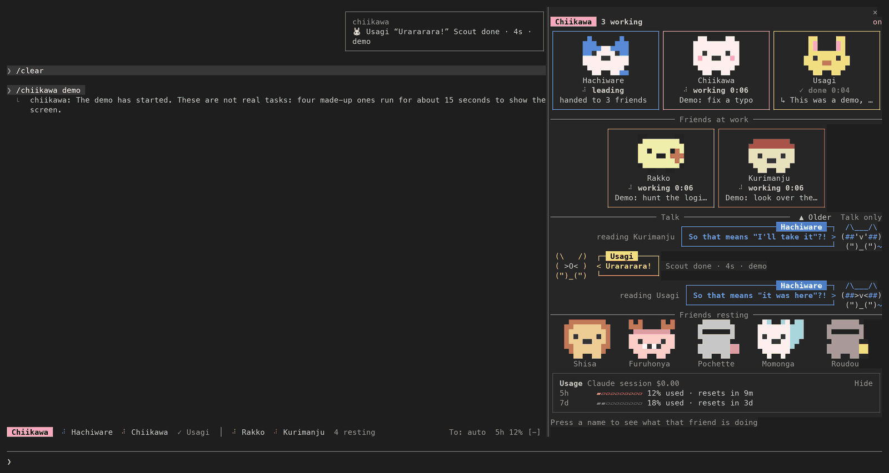
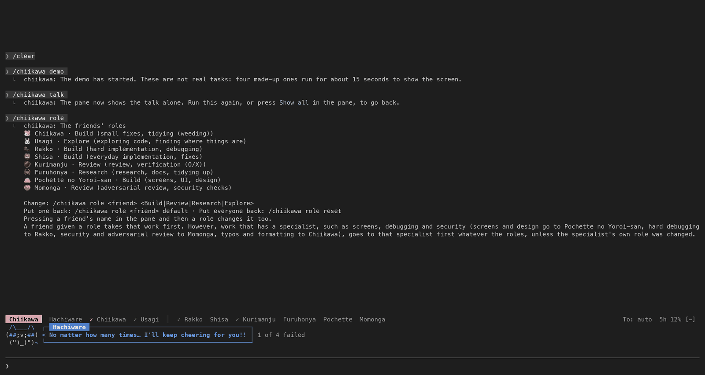
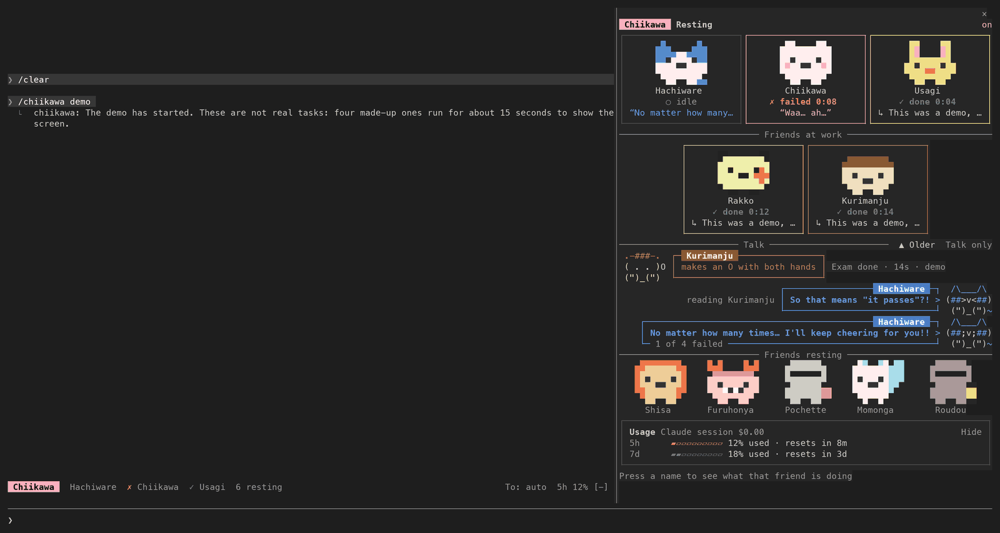
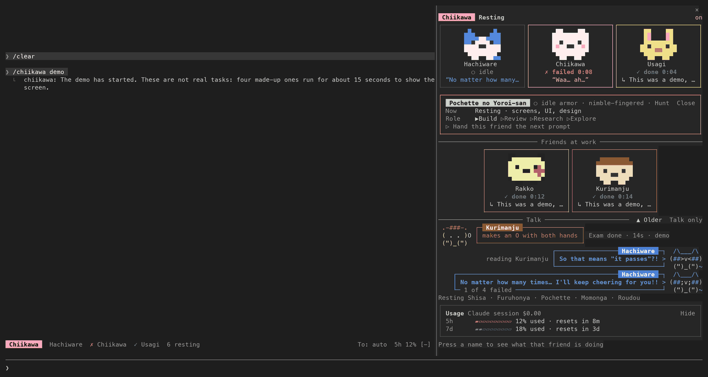
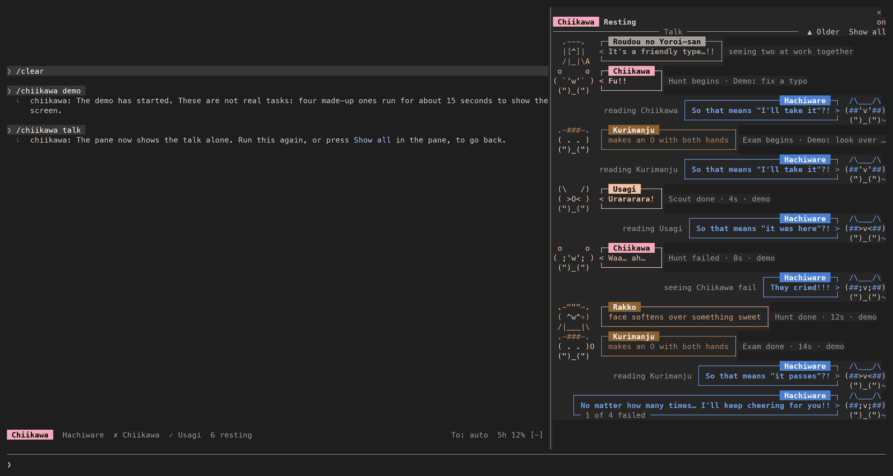
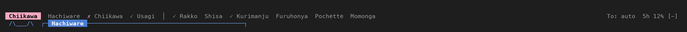

# chiikawa — Chiikawa mode for Claude Code

English · [한국어](README.ko.md) · [日本語](README.ja.md)

A mod (plugin) for Claude Code in which **Hachiware conducts, and Chiikawa, Usagi and their friends take the work and talk it over like a comic**. A cut and a speech bubble for each character show who is doing what right now. It is an **unofficial fan mod** made by a fan of the comic Chiikawa (ちいかわ). It has nothing to do with the author Nagano (ナガノ), the publisher, the animation producers or any other rights holder, and none of them has approved it. It uses no official art or logo: the text drawings and pixel icons on the screen were drawn for this mod. It runs in English, Korean or Japanese (English by default, Korean for a Korean reader, Japanese for a Japanese reader). Version 0.2.0.



Tell Hachiware something like "have Rakko find the cause of the login bug, Kurimanju review the fix, and Furuhonya look into the docs", and the pane on the right shows the three of them at work. When they are done, Hachiware gathers the results and tells you. The friends who cannot talk (Chiikawa, Usagi, Kurimanju, Furuhonya) only make sounds and gestures, and Hachiware puts what they mean into words.

> The screenshots are the terminal output of a real Claude Code session (in an example folder, `hello-app`), redrawn as pictures character for character and color for color, and the usage figures in them are example values. Fonts and colors vary a little by terminal.

## Contents

- [Install (3 minutes)](#install-3-minutes)
- [First steps](#first-steps)
- [Friends and roles](#friends-and-roles)
- [What you see](#what-you-see)
- [Commands](#commands)
- [Settings](#settings)
- [Language](#language)
- [Troubleshooting](#troubleshooting)
- [What this mod does on your machine](#what-this-mod-does-on-your-machine)
  - [Privacy](#privacy)
- [Having an AI install and use it](#having-an-ai-install-and-use-it)
- [Orca fleet-run integration (optional)](#orca-fleet-run-integration-optional)
- [Development](#development)
- [Notices and sources](#notices-and-sources)

## Install (3 minutes)

### What you need

- **Claude Code**: the program you run as `claude` in a terminal. If you do not have it yet, install it first from the [Claude Code page](https://claude.com/claude-code).
- The mod was built and tested on Claude Code 2.1.291. Check yours with `claude --version`, and bring an old one up to date with `claude update`.
- Nothing else. There is no Node.js or other program to install.

### Installing

1. Open a terminal and run `claude`.
2. Paste this one line into Claude Code's prompt and press Enter.

   ```
   /plugin install chiikawa --marketplace techkwon/chiikawa
   ```

3. Answer what the screen asks.
   - If it asks whether to add the marketplace, accept. A marketplace is a place plugins are fetched from (here, this GitHub repository) that Claude Code keeps on record.
   - If it asks for a scope (where the mod is to be used), choose user. The mod is then there in every project.
   - If it asks for settings, go on as it is unless you want something changed. You can change it later.
4. When a line says the install is finished, you are done. If `/chiikawa` is not there right away, start Claude Code again.

The same install can be done in two lines from a terminal, outside Claude Code.

```
claude plugin marketplace add techkwon/chiikawa
claude plugin install chiikawa@chiikawa
```

To give settings as you install, add `--config` (it can be repeated). For example, to fix the screen to Korean:

```
claude plugin install chiikawa@chiikawa --config language=ko
```

### Checking that it is installed

In a terminal, run `claude plugin list` and see that `chiikawa@chiikawa` is on the list. Then type `/chiikawa` in Claude Code's prompt. The friends' status pane opens and the reply says `Opened the friends' status pane.` (on a Korean screen, `먼작귀 친구들 현황 패널을 열었어요.`).

### Another way (from a copy of the repository)

```
git clone https://github.com/techkwon/chiikawa.git
claude --plugin-dir ./chiikawa
```

This loads the mod for that session only. Use it to work on the mod, or to try it without installing it.

### Updating and removing

Run these in a terminal, outside Claude Code.

```
claude plugin update chiikawa@chiikawa
claude plugin uninstall chiikawa@chiikawa
```

An update takes effect after Claude Code is started again. To turn the mod off for a while, do not remove it: type `/chiikawa off`, and `/chiikawa on` to turn it back on. Whether it is on or off is kept in that session's state alone and is not saved to disk, and the default is on.

`claude plugin uninstall` removes the mod alone. Three things may be left for you to clear. More about each is under [Privacy](#privacy).

- **The saved roles and language.** They are in Claude Code's plugin store, not in the mod's folder. By its help, `claude plugin uninstall` removes the plugin's persistent data directory unless you add `--keep-data`, but this guide does not promise that these two values go with it. To be sure they are cleared, type `/chiikawa role reset` and `/chiikawa lang auto` in Claude Code before you uninstall. Do it last: a prompt typed afterwards in Hangul or kana is remembered again.
- **The marketplace entry** (the record of where the mod was fetched from). It has a command of its own: `claude plugin marketplace remove chiikawa`.
- **Orca voice copies**, only if you used Orca with `orcaVoice` on. They are the files named `<name>.chiikawa-<character>.md` beside your spec files. The mod never deletes them. Delete the ones you do not need by hand.

## First steps

You can type these as they are.

1. **Watch the demo**: no real work is done. Four made-up tasks (Usagi scouting, Rakko hunting, Chiikawa fixing a typo, Kurimanju reviewing) run for about 15 seconds and show how the screen moves. Chiikawa's task ends in failure on purpose, so you also see what a failure looks like.

   ```
   /chiikawa demo
   ```

2. **Light work, the three together**: ask as you usually do. Work the size of reading a few files and changing a little is done by Hachiware without calling another friend. The screen then shows Usagi finding and Chiikawa fixing.

   ```
   Find where README.md explains the install, and fix any typo you see.
   ```

3. **Hand work to friends by name**: say a name, and that friend gets the work. Work handed to a friend is done by a subagent (a helper AI the main session starts), which reports in that friend's voice.

   ```
   Have Rakko find the cause of the bug in src/index.js, and have Kurimanju review the fix.
   ```

   To hand your whole next prompt to one friend, type `/chiikawa rakko` first and then what you want done.

4. **Change a role**: to have Rakko take reviews, type the line below. Pressing a friend's name in the pane and then a role button does the same.

   ```
   /chiikawa role rakko review
   ```

5. **See the talk alone**: fill the pane with what the friends have said to one another. Type it once more to go back.

   ```
   /chiikawa talk
   ```

6. **See your usage**: the usage card in the pane and the band above the prompt show the context left (how much this conversation can hold at once) and your plan's limits. For the same in text, `/chiikawa usage`.

7. **Change the language**: if the screen is not in the language you want, choose one as below. `ko` is Korean and `ja` is Japanese.

   ```
   /chiikawa lang en
   ```

Work handed to friends costs tokens (the unit that counts the text an AI reads and writes) for each friend. So the mod tells the model to do light work itself and hand out only work that takes effort. Whether work is really handed out is decided by the model, from your request.

## Friends and roles

| Friend | Mark | In the comic | Default role | Work it takes | How it talks |
|---|---|---|---|---|---|
| Hachiware | 🐱 | cat, maybe · Weeding Certification, Grade 5 | Lead | Sharing out the work, putting the friends into words. This is the main session (the Claude you are talking to) | Casual |
| Chiikawa | 🐹 | hamster · Weeding Certification, Grade 5 | Build | Small fixes, tidying (weeding) | Sounds and gestures only |
| Usagi | 🐰 | rabbit, maybe · Weeding Certification, Grade 2 | Explore | Exploring code, finding where things are | Cries only |
| Rakko | 🦦 | sea otter · #1 in the monster-hunting rankings | Build | Hard implementation, debugging | Short, flat statements |
| Shisa | 🦁 | shisa lion-dog · Super Part-Timer | Build | Everyday implementation, fixes | Polite |
| Kurimanju | 🌰 | chestnut bun · holds a drinking license | Review | Review, verification (O/X) | An O or an X with both hands |
| Furuhonya | 🦀 | crab · secondhand bookseller | Research | Research, docs, tidying up | Looks and gestures only |
| Pochette no Yoroi-san | 👛 | armor · nimble-fingered | Build | Screens, UI, design | Gentle |
| Momonga | 🍑 | flying squirrel · makes unreasonable demands | Review | Adversarial review, security checks | Cheeky |
| Roudou no Yoroi-san | 🔔 | armor · hands out the work assignments | (takes no tasks) | Announcing new work, warning of anything suspicious | Mutters alone |

"Work it takes" is this mod's casting, not something the comic says. The names and the words under "In the comic" differ by language (see the tables under [Language](#language)).

Who takes a task is decided like this.

1. **The friend you named.** You said a name in your request, or picked one with `/chiikawa rakko`.
2. **The specialist, where the work has one.** Security and adversarial review go to Momonga first, screens, UI and design to Pochette no Yoroi-san, hard debugging and finding a cause to Rakko, and small touches such as typos, formatting and renaming to Chiikawa. Where two fit, the earlier one wins (a security check of a screen is Momonga's). Build work asked for on a small model (haiku) also goes to Chiikawa first.
3. **Otherwise, the role's own friends in order.** The kind of work (build, review, research, explore) is told from the subagent's type and the words of its description; with no such word and no specialty, it is taken as build. Build goes Shisa → Rakko → Pochette no Yoroi-san → Chiikawa, review Kurimanju → Momonga → Rakko, research Furuhonya → Shisa → Usagi, explore Usagi → Furuhonya → Chiikawa, and when the first is busy the next one with free hands takes it.

Good to know:

- **The friends who cannot talk** (Chiikawa, Usagi, Kurimanju, Furuhonya) do not speak in sentences, as in the comic. The first line of a report holds one sound or gesture alone, such as `“Fu!!”`, `“Ura!”` or `(makes an O with both hands)`, and the plain report starts on the second line. Hachiware reads it for you, as in `So that means "all done"?!`.
- The voice goes **only on the report**. The mod tells the model to keep it out of code, commands, commit messages and file contents.
- The screen uses the comic's names for work. Building and bug fixing are a **Hunt**, a review is an **Exam**, research is **Forage**, tidying is **weeding**, and token usage is **pay**.
- Claude Code's forks, the teammates of Agent Teams, and subagents whose type starts with `codex:` are not cast and are left as they are.

Roles can be changed. Press a friend's name in the pane or the band, and on the sheet that opens press one of Build, Review, Research and Explore in the `Role` row; or type something like `/chiikawa role rakko review`.



- A friend given a role takes that role's work **before** the friends whose own role it is, and leaves the order of its original role. It is not a swap, so several friends can have the same role.
- **A specialty comes before a role.** Even with roles changed, work that has a specialist under 2 above (screens and design to Pochette no Yoroi-san, hard debugging to Rakko, security and adversarial review to Momonga, typos and formatting to Chiikawa) goes to that specialist first. But if you changed the specialist's own role, that friend leaves the specialty too. The command's reply to a role change says this as well.
- A changed role applies from the next task on and stays for later sessions (if it could not be saved, the reply says it holds for this session only). `/chiikawa role rakko default` puts one friend back, and `/chiikawa role reset` everyone.
- Hachiware's lead cannot be changed, and Roudou no Yoroi-san takes no tasks and so has no role.

## What you see

### The pane on the right



From the top:

- **The title row**: beside `Chiikawa`, the state right now (`2 working`, `The three, together`, `1 waiting`, `Resting`).
- **The three**: the cuts of Hachiware, Chiikawa and Usagi are always at the top. Each cut holds a pixel icon, the name, the state, and one line of what the character is doing or last said.
- **Friends at work**: any other friend gets a cut of the same shape only while it has work, and goes back to the bench about 30 seconds after the work ends.
- **Talk**: the friends' lines pile up as cuts with speech bubbles. A friend is drawn on the left and Hachiware, answering, on the right. A line is in a round bubble and a gesture in a square box. There are three cuts to begin with, and up to eight where there is room. Press `▲ Older` and `▼ Newer` to page through the earlier talk (up to 120 lines are kept).
- **Friends resting (the bench)**: friends with no work sit there as an icon and a name. One that finished work this time has `✓` or `✗` beside its name.
- **The usage card**: **Battery** is how much of this conversation's context window is **left**; **5h** and **7d** are how much of your plan's limits is **used**, and the time until each resets. Under them, `Pay per friend` is the tokens (in, cache, out) each friend has used this session so far. It is counted apart from the task records, so it stays when `/chiikawa clear` clears those, and `/chiikawa clear all` clears it. Press `Hide` to fold the card to one line, and press that line to open it again.

A state reads `● working 0:12` (the mark turns while the work goes on), `◐ waiting`, `✓ done`, `✗ failed` or `○ idle`. While the three do light work together, Hachiware is `on it together` and Chiikawa and Usagi are `lending a hand`.

Where the pane has room (50 columns wide and 17 rows tall, or more) it is drawn as cuts, as above; smaller than that, as a list with two rows a friend. However wide the pane is, no more than 84 columns are used.

### A friend's sheet



Press a friend's name in the pane or the band and that friend's sheet opens. Press the same name again, or `Close`, to put it away.

- `Now`: the name of the task in hand, which subagent (or Orca profile) it is, how long it has run, and the tool in use (as in `▸ Read index.js · 3 tool calls`).
- `Done` and `Report`: the task most recently finished, and up to the first six lines of the report handed back.
- `Pay` and `Said`: the tokens that friend has used, and the last two things it said.
- `Role`: press one to give that role. The role it has now is marked `▶`.
- `▷ Hand this friend the next prompt`: press it, and the next prompt you type goes to that friend. Press again to cancel. On Hachiware's sheet it reads `▷ Have Hachiware do the next prompt`.
- Where the pane is short or narrow, the sheet gives things up in this order: the rows above (from the last one up), then the role buttons (their names are cut short before they are left out), then the hand-over button. The name and `Close` stay to the end.

### The talk alone



Press `Talk only` at the end of the talk row, or type `/chiikawa talk`, and the whole pane is filled with the talk. Press `Show all`, or type `/chiikawa talk` once more, to go back. Where the pane is narrower than 50 columns, each line of talk is shown on one row instead of as a cut.

### The band above the prompt



- **The friends' names**: the three first, then the others. Press a name and that friend's sheet opens in the pane. A friend with work has a state mark before its name and the time the work has run after it.
- **`To: auto`**: who takes your next prompt. The default is auto (Hachiware shares the work out); once you pick a friend it reads `To: Rakko`, and that friend's name is marked `▶`. Press it to undo the pick.
- **Usage**: it reads like `Battery 82% · 5h 12%`. Press it and the pane opens with the usage shown in full.
- **The last line, as one cut**: while the pane is closed and there is talk going on (work in hand, or about 45 seconds after the last line), the last line is drawn under the band as one cut. With the pane open, the band is one row alone.
- Where the width runs short, things are dropped in this order: the times, the 5h figure of the usage, the names of resting friends (they shrink to a count such as `4 resting`; press it and the pane opens), the names of friends at work, `To:`, and the usage.

### And more

- **Spinner text**: while you wait it reads like `🐱 Hachiware is thinking it over` or `🐱 Hachiware is leading`.
- **The line after a turn**: a word from Hachiware (`“The best!!”` or `“It's the best, isn't it!”`) and how long the turn took. After a turn of ten minutes or more it is `“No matter how many times… I'll keep cheering for you!!”`.
- **Toasts**: when a friend's work ends, a toast shows that friend's line and the result (as in `Hunt done · 12s`).
- **Lines for the moment**: they appear in the talk when the moment comes. When new work is posted, Roudou no Yoroi-san says “First come, first served!”; when two friends come to work at once, “It's a friendly type…!!”; when a task passes three minutes, its friend says a line and Momonga, if free, says “I'm so hungry I feel kinda sick—!!!”; when a friend's tool call is denied, Roudou no Yoroi-san says “A mimic type, huh~?”; when Chiikawa's task fails, Hachiware says “They cried!!!”; and when several tasks end well together, “Easy!! Easy!!!”.
- **Movement**: the text drawing of a friend at work walks and its icon bounces. While nobody is at work, the drawings do not move.
- **Light and dark screens**: if the name of the Claude Code theme has `light` in it, the mod draws in deeper colors that read on a light background. A change of theme is followed when you next send a prompt or run `/chiikawa`. If the colors do not suit, fix "Color theme" in the settings to `light` or `dark`.

## Commands

| Type | What it does |
|---|---|
| `/chiikawa` | Opens the friends' status pane, and shows the status and the recent talk as text too |
| `/chiikawa demo` | Runs four made-up tasks for about 15 seconds to show the screen. No real work is done. Only while the mode is on |
| `/chiikawa on` · `/chiikawa off` | Turns the mode on and off. Off, the voice instructions stop, and the band, the spinner text and the line after a turn are no longer drawn. A pane that is already open is not closed: it stays, with `off` at the right of its title. Work already handed out is still closed and its usage counted when it ends, even while the mode is off (an Orca worker's result is read once the mode is back on), with no toast and no line in the talk |
| `/chiikawa usage` | Shows the usage (context, limits, cost, tokens per friend) as text |
| `/chiikawa talk` | Turns the pane to the talk alone. Typed once more, it goes back to showing everything |
| `/chiikawa rakko` (a friend's name) | Hands the next prompt you type to that friend. The same name again cancels it. `/chiikawa hachiware` has Hachiware do it without handing it out |
| `/chiikawa auto` | Undoes the pick: prompts go by auto (the default) again |
| `/chiikawa role` | Shows the friends' roles as text |
| `/chiikawa role rakko review` | Gives Rakko the review role. Roles: build, review, research, explore (hunt, exam and forage work too) |
| `/chiikawa role rakko default` · `/chiikawa role reset` | Puts one friend, or everyone, back to the original role |
| `/chiikawa lang` | Shows the language in use and what settled it |
| `/chiikawa lang en` (`ko` · `ja`) | Chooses the language. It stays for later sessions (if it could not be saved, the reply says it holds for this session only) |
| `/chiikawa lang auto` | Clears both the language you chose and the one remembered from the letters you typed, and lets the language be settled automatically |
| `/chiikawa clear` | Clears the finished tasks and the talk. Tasks still running and each friend's pay (the usage so far) are kept |
| `/chiikawa clear all` | Clears every task, even those still listed as running, along with the talk and each friend's pay (the usage so far) |

- Names of friends and of roles are understood in any of the three languages, in capitals or not (`rakko` · `랏코` · `ラッコ`, `review` · `검토` · `レビュー`). Furuhonya also answers to `kani`, `카니`, `헌책방` and `古本屋`, and Pochette no Yoroi-san to `pochette`, `포쉐트`, `포셰트` and `ポシェット`. The Korean edition's names (토끼, 해달, 밤만쥬, 하늘다람쥐) work too. Hachiware is known only as `hachiware`, `하치와레` or `ハチワレ` (not by the Korean edition's name).
- A picked friend is used for **your next prompt alone**; once that prompt has gone in, prompts go by auto again. A slash command (one that starts with `/`) does not use up the pick: it waits for the next ordinary prompt.

## Settings

You set these on the screen that asks as you install, and change them later by typing `/plugin configure chiikawa@chiikawa` in the prompt. If a changed setting does not show right away, start Claude Code again.

| Key | Title on the screen | Default | What it does |
|---|---|---|---|
| `language` | Language | `auto` | A value you type: `auto` · `en` · `ko` · `ja`. `auto` follows the order under [Language](#language). Anything else is read as `auto` |
| `leaderVoice` | Hachiware's voice | on | The main session talks in the voice of Hachiware, the conductor. Off, the briefing is given neither in the system prompt nor beside a prompt, and no `[Chiikawa roles]` line is added. The rest stays: the screens, the casting (a subagent's description, the `[Chiikawa cast]` line after a result), the friends' voices for subagents (`memberVoice`), Orca voice copies (`orcaVoice`), and the `[Chiikawa pick]` line when you pick a friend |
| `politeLeader` | Polite Hachiware | off | Hachiware speaks politely instead of in the casual speech of the comic |
| `memberVoice` | The friends' voices | on | A subagent reports in the voice of the character cast for it (a friend who cannot talk reports with a sound) |
| `orcaVoice` | Orca workers' voices | on | A `fleet-run` launch is handed a copy of its spec, made beside it, with the character's voice added (only if you use Orca) |
| `band` | Band of friends above the prompt | on | Shows one row above the prompt with the friends' names, who takes the next prompt and the usage; only while the pane is closed, the last line said is drawn under it as one cut |
| `trio` | The three together | on | Shows light work the main session does itself as Hachiware, Chiikawa and Usagi at it together (Usagi for tools that search, Chiikawa for tools that edit) |
| `animate` | Movement while working | on | The drawing and the icon of a character at work move every half second (the state mark turns with them). Off, only that half-second movement stops. The screen is still redrawn when something changes (a task starts or ends, a tool is called, you press something) and by the check that runs every 2 seconds |
| `theme` | Color theme | `auto` | A value you type: `auto` (follows the Claude Code theme) · `dark` · `light`. Anything else is read as `auto` |
| `autoOpen` | Open the pane by itself | on | The pane opens by itself when a friend is handed work (where the terminal is 144 columns wide or more). Once you close it by hand, it is not opened again until `/chiikawa` |

## Language

The words on the screen, the command's replies, the characters' names and lines, and the briefing given to the model are all in one language: English, Korean or Japanese. It is settled by the first of these that holds.

1. The mod's own `language` setting, when it is `en`, `ko` or `ja`, fixes the language.
2. The language chosen with `/chiikawa lang <en|ko|ja>`. Once it is saved, it stays for later sessions.
3. The letters of the prompts you type. Hangul means Korean and kana means Japanese (with both, whichever there is more of). A prompt in Latin letters or Han characters alone, and a command that starts with `/`, change nothing. The language changes only when there are two or more Hangul or kana letters, and when the letters change it a toast tells you, with the command that turns it back (while the mode is on). A language settled this way is remembered for later sessions too, once it is saved.
4. Claude Code's own language setting (when it is Korean, Japanese or English).
5. The first of the environment variables `LC_ALL`, `LC_MESSAGES` and `LANG` that has a value.
6. With none of these, English.

- `/chiikawa lang` tells you the language and which of the above settled it. `/chiikawa lang auto` clears both the choice of 2 and the language remembered under 3.
- Once the screen has turned Korean or Japanese, typing in English alone does not turn it back (Latin letters change no language). To go back to English, use `/chiikawa lang en`. `/chiikawa lang auto` is not the same: it has the language settled afresh by 3 to 6 above, so where Claude Code's language setting or the locale is Korean or Japanese, the screen turns Korean or Japanese again.
- **Saving.** A language (chosen, or settled by typed letters) and a changed role carry over to later sessions only when the save worked. When it did not, the reply says it holds for this session only; where typed letters changed the language, the toast says so, and the save is tried again beside your next prompts. In a session that could not read the saved values, the mod saves neither roles nor language, so as not to write over what is kept, and says the same "this session only".
- **When the language changes, the talk follows.** The lines the mod itself wrote (the characters' lines, Hachiware's readings, notes such as how many tasks are done) are shown in the new language, the ones already in the talk too. What a person or another AI wrote stays as written: a task's title, a tool's target (a file's name, the start of a command), and the lines of a report. The first line of a report from a friend who cannot talk is changed only when it is, letter for letter, one of that friend's own sounds or gestures and the other language has that very line.
- **After `/clear`.** The saved language and roles are read again the first time the mod is used (a prompt, `/chiikawa`, a press on the band or the pane) or by the check that runs every 2 seconds, whichever comes first. For a moment before that, the screen may show English and the default roles.
- While the `language` setting is fixed, a language chosen with `/chiikawa lang` is only remembered and the screen stays as it is. It applies once the setting is back on `auto`.
- When the language changes, the briefing is given once more, in the new language, beside your next prompt. Talk already on the screen stays in the language it was said in.
- The mod's language sets the screen and the characters' voices only. Where you have asked for answers in some language (in CLAUDE.md or the like), the mod tells the model that your instruction comes first.

The names differ by language. In a command, a name in any of the three works.

| Mark | 한국어 | 日本語 | English |
|---|---|---|---|
| 🐱 | 하치와레 | ハチワレ | Hachiware |
| 🐹 | 치이카와 | ちいかわ | Chiikawa |
| 🐰 | 우사기 | うさぎ | Usagi |
| 🦦 | 랏코 | ラッコ | Rakko |
| 🦁 | 시사 | シーサー | Shisa |
| 🌰 | 쿠리만쥬 | くりまんじゅう | Kurimanju |
| 🦀 | 카니 | 古本屋 | Furuhonya |
| 👛 | 포쉐트 갑옷 씨 | ポシェットの鎧さん | Pochette no Yoroi-san |
| 🍑 | 모몽가 | モモンガ | Momonga |
| 🔔 | 노동 갑옷 씨 | 労働の鎧さん | Roudou no Yoroi-san |

| Role | 한국어 (the comic's name for the work) | 日本語 | English |
|---|---|---|---|
| Lead | 지휘 | 指揮 | Lead |
| Build | 구현 (토벌) | 実装 (討伐) | Build (Hunt) |
| Review | 검토 (검정) | レビュー (検定) | Review (Exam) |
| Research | 조사 (채집) | 調査 (採取) | Research (Forage) |
| Explore | 탐색 | 探索 | Explore (Scout) |

The lines differ by language too. The Korean cast has lines the Japanese and English casts do not. The reason is under [Notices and sources](#notices-and-sources).

## Troubleshooting

| What you see | What to try |
|---|---|
| `/plugin install …` is not available | Check that you are typing in the prompt of Claude Code run in a terminal. If it still fails, install from a terminal, outside Claude Code, with the two lines `claude plugin marketplace add techkwon/chiikawa` and `claude plugin install chiikawa@chiikawa` |
| The marketplace is not found | Check that the address is `techkwon/chiikawa` |
| There is no `/chiikawa` | In a terminal, run `claude plugin list` and look for `chiikawa@chiikawa`. Not on the list: the mod is not installed, so install it. On the list with a `Status` of disabled: run `claude plugin enable chiikawa@chiikawa`, then start Claude Code again. On the list and enabled: start Claude Code again. If Claude Code is old, `claude update` |
| The screen is not in the language you want | First type `/chiikawa lang` and read what settled the language. If the reply says the mode's own `language` setting fixes it, `/chiikawa lang <en\|ko\|ja>` cannot change the screen: type `/plugin configure chiikawa@chiikawa` and set `language` to the language you want, or to `auto`. With `language` on `auto`, choose one with `/chiikawa lang <en\|ko\|ja>`. To keep one language always, type `en`, `ko` or `ja` into the `language` setting |
| The pane does not open by itself | It does not where the terminal is narrower than 144 columns, nor after you have closed it by hand. Type `/chiikawa` and it opens at any width |
| The drawings are small, or there is only a list of text and no cuts | That is how a small pane looks. Make the terminal window bigger (50 columns and 17 rows or more for the pane) for the cuts and icons |
| The colors are faint or hard to read | Fix "Color theme" in the settings to `light` or `dark` to match your theme |
| The voice gets in the way of work | Turn the mod off with `/chiikawa off`, or turn off only the voices in the settings: `leaderVoice` and `memberVoice`, and `orcaVoice` too if you use Orca (the screens stay). This holds for work handed out from then on. A subagent or an Orca worker that already has its voice instructions keeps them until its work ends, and a voice copy already made stays. If the casual speech bothers you, turn `politeLeader` on |
| The band above the prompt takes too much room | With the pane open (`/chiikawa`) the band is one row alone. To be rid of it, turn `band` off in the settings |
| The movement is distracting, or the screen flickers | Turn `animate` off in the settings |
| Chiikawa and Usagi are shown working though you handed them nothing | That is the feature that shows the main session's own work as the three at it together. If you do not want it, turn `trio` off in the settings |
| A friend stays "waiting" for a long time | The result file of an Orca worker was not found. Press that friend's name, read the note on the sheet, and check the result file yourself. If no result ever comes, the mod lets the task go by itself after an hour or two. To clear it at once, `/chiikawa clear all` |

If none of that helps, run `claude --debug` and put the error lines it shows, and the output of `claude --version`, in an [issue](https://github.com/techkwon/chiikawa/issues). Please take out anything personal and any key first.

## What this mod does on your machine

A mod runs with your own permissions, not in a sandbox. So here is everything it reads, runs, writes, keeps and changes.

### Privacy

- **The maker of this mod receives no data.** The mod makes no network call, has no analytics and no remote server, and runs no program. Nothing it reads leaves your machine by the mod's own doing.
- **Held in the session's state only**: the task records (who took what, the tool target shown on the screen such as a file's name or the start of a command, and up to six lines of each report), the talk (up to 120 lines), the usage figures, the friend you picked, and whether the mode is on. The mod writes none of this to a file, and a new session starts without it. To clear it during a session, `/chiikawa clear all` clears the task records, the talk and each friend's pay at once. Other plugins in the same session can read the session's state.
- **Kept on disk**: two things only.
  - The roles you changed and the language (the one you chose, and the one remembered from the letters you typed), in Claude Code's plugin store. They hold no text you typed. They stay until you clear them: `/chiikawa role reset` clears the roles and `/chiikawa lang auto` the language.
  - Orca voice copies (`<name>.chiikawa-<character>.md`), made beside your spec files only if you use Orca with `orcaVoice` on. A copy holds the whole spec, and nothing filters out personal information. The mod never deletes a copy: it stays until you delete the file.
- **What does reach the model and other AI workers**
  - The text the mod adds (the section in the system prompt, the notes beside a prompt, the cast block at the end of a subagent's instructions, the one line after a tool's result) reaches the model the same way your prompt does.
  - An Orca voice copy is read by that worker (another AI). Anything sensitive in a spec reaches that worker through the copy as well.

### In detail

- **Runs no program.** It starts no process and no shell command.
- **Reads**
  - A subagent's type, description and requested model, its instructions (read to add the cast block at their end; not kept), each tool call's name and target (a file's name, or the first 48 characters of a command or a query), the report a subagent hands back (the whole text is read; only its first six lines that say something are kept, each cut to 160 characters), and the tokens used.
  - The name and target of the main session's own tool calls, and the tokens each turn used. Of a Bash command it looks at whether `fleet-run` is in it, and only then reads the command to find the launch and its paths.
  - Of a prompt you type, only whether it starts with `/` and, to tell the language, how many Hangul and kana letters it has (in its first 2,000 characters). The text itself is not kept.
  - The session's usage figures (context, plan limits, cost), the list of running subagents, the list of open panes, and the list of Claude Code settings (of which it uses the theme's name and the language).
  - Of the environment, four variables: `HOME` (to resolve `~` in a command) and `LANG`, `LC_ALL` and `LC_MESSAGES` (to tell the language). It reads no credential or key.
  - Files, only around an Orca `fleet-run`, and each of them whole: the spec (`--spec`, only with `orcaVoice` on), the result (`--out`), the `<out>.meta.json` beside it, and a file already standing where a voice copy would go (its text is compared so that it is not written over). A file over 4 MiB is not read (Claude Code refuses such a read). Of the result, only the first six lines that say something are kept, each cut to 160 characters, to show as the report. The spec's text goes into the voice copy and is not kept anywhere else.
- **Writes one kind of file.** Beside an Orca `fleet-run` spec, a copy named `<name>.chiikawa-<character>.md` with the character's voice instructions added at its end (the character part is an id such as `rakko`). The original is left alone. The mod looks first, and does not write where it finds a file. After writing, it reads the copy back, and if the text is not what it wrote, it does not use that copy: the worker runs from the original spec. One case it cannot rule out: a file another program creates under that very name in the instant between the look and the write would be written over. Nothing is written with `orcaVoice` off.
- **Keeps two settings** in Claude Code's plugin store (`$.store`): the roles you changed (`roles`) and the language (`lang`: the one chosen with `/chiikawa lang`, and the one remembered from the letters you typed). Everything else (task records, the talk, usage figures, whether the mode is on) lives in the session's state alone.
- **Changes**
  - It adds one section, "Chiikawa mode", to the system prompt (`prompt.compose`).
  - It adds notes beside a prompt you type (`prompt.submit`): the same briefing beside the first prompt of a session, the one after a compaction and the one after the language changes; one line, once, to drop the voice after the mod is turned off while a briefing still stands in the conversation (beside the next prompt; also when the language had just changed, and when the mod was turned off while the prompt carrying the briefing was still being sent). After a compaction, and in the new session a `/clear` starts, no briefing stands, so no such line is added; a `[Chiikawa pick]` line when you have picked a friend; a `[Chiikawa roles]` line when you have changed the roles. The prompt's own text is not changed.
  - It replaces a subagent's description with one that opens with the friend's mark and name, and adds a `[Chiikawa cast]` block at the end of its instructions (`agent.spawn`).
  - It adds one `[Chiikawa cast]` line, naming who took the task, after an Agent tool's result (`tool.call`).
  - It rewrites a Bash command in one case only: the `--spec` path of a `fleet-run` is pointed at the copy above (`orcaVoice`). One line naming who took the task follows that result too. Every other tool input goes through as it is.
  - These markers follow the language. In Korean they are `[치이카와 배역]`, `[치이카와 지명]` and `[치이카와 역할]`, and in Japanese `[ちいかわ配役]`, `[ちいかわ指名]` and `[ちいかわ役割]`.
  - On the screen it draws the spinner text, the line after a turn, the band above the prompt and its own pane (`ui.render`), shows toasts, and opens its pane.
  - Its other hooks (`session.start`, `session.compact`, `turn.complete`, `ui.close`) only observe. From the start of a session a timer checks on the tasks every 2 seconds and, with movement on, another moves the drawings every half second (only while a friend is at work).
- **It takes no permission decision.** It never allows or denies a tool call; it only looks at the result.
- **It hooks no setting as it is made.** There is no `config.set` hook: the theme's name and the language are read when a prompt is sent and when `/chiikawa` is run.
- **It registers one command**, `/chiikawa`, and no tools, agents, skills or MCP servers.

## Having an AI install and use it

Give an AI coding tool such as Claude Code this repository's address and ask:

```
Read AGENTS.md at https://github.com/techkwon/chiikawa and install the chiikawa mod.
```

[AGENTS.md](AGENTS.md) is written for an AI to read (in English; it tells the AI to guide you in the language you use). It has the install commands and their order, how to check the install, what to do when the install fails, how to hand work to friends in a session with the mode on, and the rules for changing this repository's code.

## Orca fleet-run integration (optional)

This part is for people who launch other AI workers (Codex, Grok and so on) from Orca with `fleet-run <profile> --spec <file> --out <file>`. If you do not use Orca you can skip it: the mod works the same without Orca.

- A worker is cast by what its profile is for. `codex-scout` is explore, `grok-research` is research, `agy-review` and `claude-review` are review, and every other profile (`codex-build`, `grok-build`, `claude-build` and so on) is build. A profile with a specialty goes to its specialist first: `codex-hard` to Rakko, `agy-pro` to Pochette no Yoroi-san, `agy-fast` to Chiikawa, `agy-review` to Momonga. A word in the spec file's name follows the same rule, in English, Korean or Japanese: `security` or `보안` goes to Momonga, `debug` or `デバッグ` to Rakko.
- Only a `fleet-run` standing where the shell really runs it counts: as a command of its own (a variable assignment in front, as in `VAR=… fleet-run`, is fine); behind `nohup`, `env`, `timeout`, `exec` or `command`; joined to other commands with `&`, `;`, `&&`, `||` or a pipe; inside `if`, a loop, `{ }`, `( )` or `$(…)`; and inside a script handed in quotes to `bash -c "…"` (`zsh` and `sh` too) or to `orca terminal create --command "…"`. A redirection may stand anywhere in the command. The profile has to be written out as two lowercase words joined by a hyphen (`codex-build`), in quotes or not.
- The name is not a task where the shell does not run it there: in a comment, in a line of a here-document, as an argument of another command such as `echo`, or in the body of a function (the mod does not follow a function to where it is called). Such a command runs exactly as you wrote it, and nothing is shown for it.
- **A path is read only when the mod can be sure it is the very value the shell will hand over. Otherwise the command is left exactly as you wrote it.** What counts as sure is kept narrow, and is the same for bash, zsh and sh.
- Read (the usual shapes):
  - A path written out, in quotes or not: `--spec /work/run1/task.spec.md` or `--spec=/work/run1/task.spec.md`, and `--out` the same way. A path may start with `~/`.
  - A variable that the same command assigned as plain text: `R=/work/run1; fleet-run codex-build --spec "$R/task.spec.md" --out "$R/task.out.md"`. `$R`, `${R}` and `"$R"` all work, so do `export R=…` and `readonly R=…`, and one variable may be built from another (`S=$R/task.spec.md`, `R=$HOME/run1`).
  - Ordinary commands may stand between the assignment and the launch: programs such as `mkdir` and `ls`, `echo`, `cd`, a simple `[ … ]` test, `command -v`, `printf '%s\n' …`, a here-document, a redirection or a pipe, and an assignment from a command to another variable (`NOW=$(date +%s)`). `set -euo pipefail` is fine before the assignment.
  - A path may hold letters and digits of any script (Hangul, kana and Han characters included) and the signs `_ - . / : , + = @ % ~`. A space is read only where the whole path is one stretch inside quotes (`"/work/my run/task.spec.md"`).
- Not read:
  - A variable whose value is not sure: one this command did not assign (an environment variable set somewhere else), one assigned from a command (`R=$(pwd)/run1`), one assigned under a condition (`&&`, `if`) or in a loop, `{ }`, `( )`, a pipe or the background, one assigned in front of another command (`R=/x make; …`), and one declared with `declare`, `typeset` or `local`.
  - Any variable, once something that may change it has come: arithmetic (`$(( ))`, `(( ))`, `let`), `[[ ]]`, `read`, `unset`, `printf -v`, `eval`, `source`, `builtin`, `trap`, `alias`, a `set` or `shopt` after the assignment, and a function definition or a `case` earlier in the command.
  - What the shell works out by itself: `${R:-…}`, `${R%.md}`, `$R[1]`, a command substitution (`$(…)`) or backquotes in the path, `*`, `{a,b}`, `~user`, a `~` that does not open the word (the one in `--spec=~/…` too), an unquoted variable that holds a space or stands in a command that mentions `IFS`, a space written as `\ `, a full-width space, or any character other than those above.
  - An inner shell the mod cannot follow: a variable from outside in a script in single quotes (`bash -c '… $R …'`), a shell given an option before `-c` (`bash -x -c`), or one handed another `HOME`. Also a relative path in a command that has a `cd`, and `--spec` given twice.
- **Where the `--spec` path is not read, the task is still shown, but no copy is made and the command runs exactly as you wrote it.** Where the `--out` path is not read, the mod cannot see the result (see below).
- The original spec is left alone. A copy with the character's voice instructions at its end (written in the screen's language at that moment), named `<name>.chiikawa-<character>.md`, is made in the same folder and the worker is run from that copy. With `orcaVoice` off, none is made.
- **A copy is not written over a file the mod finds already there.** If a file of that name exists and holds exactly the text the copy would, it is used as it is; if it holds anything else, the copy takes a numbered name (from `…chiikawa-rakko-2.md` up to `-9`). If those are all taken too, the worker runs from the original spec with no copy. After writing, the mod reads the copy back, and a copy that does not hold what was written is not used: the worker runs from the original spec. This is care, not a guarantee: Claude Code gives a mod no way to create a file only where none exists, so a file another program creates under that very name in the instant between the check and the write would be written over. No copy is made when the spec cannot be read.
- A spec that already holds a cast block of this mod (in any of the three languages) gets no copy either: the worker runs from the spec as it is, and the task is shown as the work of the friend that block names. Where the spec holds the mod's marker but no friend can be told from it, the task is cast by the usual rules and the line after the result says that no copy was made.
- A copy holds the whole spec. Nothing filters out personal information, so anything sensitive in a spec is in its copy as well.
- A launch the shell waits for is closed as done or failed when the command ends. For one that returns at once (`&`, `nohup`, `orca terminal create`, or a Bash call that Claude Code runs in the background), the mod checks every 2 seconds for the `<out>.meta.json` the worker leaves as it ends, puts whether it succeeded, its model, the time it took and its tokens on the card, and shows the first six lines of the result file as the report.
- When the command of a launch that returns at once ends in an error, the task is marked as failed. The worker may be running all the same, so the result file is still looked for, and a result that comes corrects the task.
- Where the result file's path could not be read, the task is left "waiting" with a note to check for yourself, and is let go after an hour. Where the path is known but no result has come for more than an hour, the task turns to "waiting" and is let go after two hours. A task whose end cannot be learned is not counted as done or failed: Roudou no Yoroi-san says in the talk that it was let go. A subagent's task that is never matched to a running subagent is let go after two hours in the same way.
- When a second task names the result file of a worker that is still being waited for, its end is not read from that file. This holds when the two are launched at the same moment too: only one of them gets the result file. Its card says that another task is using the same result file and asks you to check the result yourself; with no result file to watch, a launch that returns at once is let go after an hour.
- The worker's progress screen is not read. That would take running another program, and this mod runs none.
- The voice copies stay beside the specs. The mod does not delete them: you may, once the work is done.

## Development

```
git clone https://github.com/techkwon/chiikawa.git
cd chiikawa
claude --plugin-dir .
```

This runs Claude Code with the mod loaded. Once it has loaded, Claude Code lays the type files in `.claude-plugin/types/` (they are not in the repository). Then run the checks (`tsc` is TypeScript's checker).

```
tsc -p . --noUnusedLocals
claude plugin validate .
claude plugin test .
```

| Path | What it holds |
|---|---|
| `.claude-plugin/plugin.json` | Name, version, settings |
| `.claude-plugin/marketplace.json` | What makes this repository an install address |
| `hooks/register.tsx` | Every hook (casting, voice instructions, the command, settling the language, usage, the Orca integration) |
| `hooks/view.tsx` | The pane, the band, a friend's sheet, the cuts of the talk, the usage card |
| `hooks/words.ts` | The screen's words and the command's replies in the three languages, and telling the language from letters |
| `hooks/cast.ts` · `cast.ko.ts` · `cast.ja.ts` · `cast.en.ts` | The friends and the casting rules, and the names and lines of each language |
| `hooks/voice.ts` · `voice.ko.ts` · `voice.ja.ts` · `voice.en.ts` | The texts given to the model and their markers, and knowing a name |
| `hooks/orca.ts` · `art.ts` | Reading shell commands, the text drawings and pixel icons |
| `types/index.d.ts` | The contract for the session's state |
| `tests/` | The tests |

The rules for changing the code are in [AGENTS.md](AGENTS.md).

## Notices and sources

- This is an **unofficial** mod made by a fan. It has nothing to do with the author Nagano (ナガノ), the publisher, the animation producers or any other rights holder of Chiikawa (ちいかわ), and none of them has approved it. It uses no official art, logo or photo. The text drawings (9 columns by 3 rows) and the pixel icons (10 pixels wide, 8 tall) were drawn for this mod from written descriptions of how the characters look.
- The code is under the [MIT License](LICENSE). The rights to the characters' names and lines belong to their holders.
- "Work it takes" is this mod's casting and not something the comic says. In the Korean cast, "해설 담당" (Hachiware; "the one who explains") and "트집쟁이" (Momonga; "the fault-finder") are the mod's own words, and "선배" (Kurimanju; "senior") is what fans call the character.
- **Where the character details and lines come from** (all read 2026-10-06)
  - **The Korean cast** mixes three kinds of line: the spelling of Namuwiki, the spelling confirmed on publicly shown pages of the Korean edition (대원씨아이 《먼작귀》), and the maker's own translation from the Japanese original.
    - The characters' colors, what each is good at, how each talks, and the base of the Korean spelling of the lines come from [Namuwiki](https://namu.wiki), from its article 「먼작귀/등장인물」 and each character's own article. Namuwiki is a wiki written by fans, not an official source.
    - For the Korean edition, only what was read letter by letter on pages shown for free (the Ridi preview of volume 1, photographs of pages on the publisher's blog) was matched to the edition's spelling: the name **포쉐트 갑옷 씨**; Chiikawa “후!!”, “와아……”, “싫어!!!”, “싫어~.”; Usagi “후웅?”, “이야아―핫―”, “우라라라라라”; Kurimanju “하―앗…”; Momonga “싫~어~ 싫어싫어.”, “그 맛있게 생긴 거… 내놔.”. Usagi's “우라” and Roudou no Yoroi-san's “빠른 사람이 임자!” were spelled the same on those pages.
    - Some lines were left as they are though they are known to differ from the edition. Hachiware's `그 말은 ○○라는 거?` appears in one scene of volume 4 of the edition in the shape "그 말은… 곧… ○○라는 거야?!!", but that is one scene and it was not checked against the original panel. Rakko's “온다!” is on a card in volume 3 of the edition, and Roudou no Yoroi-san's “의태형인가...?” is in the title of an anime episode, each with different punctuation only.
    - Translated by the maker from the Japanese original: “푸랴!”, “소중히… 할게!”, “앗… 고마워!”, “단 게 먹고 싶단 말이야~!”, “저리 가!”, “아~ 무서워라.”, “우호형이다…!!” and others.
    - Lines kept in the Korean cast alone, with no Japanese original found: Hachiware “그치! 틀림없지!”, “있구나~. 이런 곳에도.”; Chiikawa “나도!” (a line of the Korean dub, according to Namuwiki), “최고~”, “우우···”, “아앙~”; Rakko “온다!”; Shisa “정말 최고의 여행이에요!”; Momonga “그 맛있게 생긴 거… 내놔.”, “시끄러워!”. Lines whose sound or word is in a Japanese source but which could not be confirmed to be the same scene: Chiikawa “얌빰빰 루빠루빠”, “와, 와”; Usagi “이야아―핫―”, “이얏하! 푸루루~”, “하? 하아?”; Momonga “뭐야? 너...”; Roudou no Yoroi-san “친한 건가.”.
    - Spellings known to drift from the meaning of the original: Momonga “배고파서 기분이 좀 안 좋아!!!” (the original says the body feels unwell), Roudou no Yoroi-san “친한 건가.” (the original is closer to "friendly… is it…?"), Shisa “이런 건 금기” (the original is in polite speech).
    - The body of volumes 2 to 5 of the Korean edition and the lines of the Korean dub were not checked.
    - The Korean edition calls the characters 가르마 (Hachiware), 토끼 (Usagi), 밤만쥬 (Kurimanju), 하늘다람쥐 (Momonga) and 해달 (Rakko). The Korean cast of this mod shows the Japanese names on the screen, and in a command 토끼, 해달, 밤만쥬 and 하늘다람쥐 are understood too.
  - **The Japanese cast** uses only lines whose original was confirmed in a Japanese source. A line that could not be confirmed was left out, and a gesture in parentheses stands where a character has nothing confirmed to say. The names are the official ones (the character the Korean cast calls 카니 appears in the Japanese and English casts under the official name, 古本屋 / Furuhonya; "Kani" is a word the author added and a nickname among fans). But the number of ッ, ー and exclamation marks was not checked against the pages of the books, and some lines are spelled differently from source to source (for example なんとかなれーッ!! / なんとかなれッ, and 簡単ッ簡単ッ / 簡単ッッッ簡単ッッ！！！).
  - **The English cast** uses the same lines as the Japanese cast and no others. Official English was confirmed only for the characters' names (the official North American site) and for Usagi's “Ura!” and “Yaha!”. Every other line is either the sound written in Latin letters or this mod's own translation; which one is recorded for each line in the `RENDERED` table of `hooks/cast.en.ts`. No official English edition of the comic was found to quote, and the lines of the official English subtitles and dub were not checked. The official North American site spells the two armored characters "Pochette no-Yoroi-san" and "Roudou no Yori-san"; this mod writes "Pochette no Yoroi-san" and "Roudou no Yoroi-san".
  - A gesture in parentheses (such as `(makes an O with both hands)`) is a stage direction, not a line. No sentence is made up for a character who cannot talk. Kurimanju's gesture of making an O or an X with the hands follows Namuwiki's description; no basis for it was found in the Japanese or English sources.
  - Pages read: [Japanese Wikipedia](https://ja.wikipedia.org/wiki/ちいかわ_なんか小さくてかわいいやつ), [English Wikipedia](https://en.wikipedia.org/wiki/Chiikawa), [the character page of the official North American site](https://www.chiikawaofficial.com/characters), [the global site of Chiikawa Pocket](https://gl.chiikawa-pocket.com/en/), [the anime's official character page](https://www.anime-chiikawa.jp/chara.html), [ピクシブ百科事典](https://dic.pixiv.net), [the character list at にじめん](https://nijimen.kusuguru.co.jp/topics/358900), [マイナビニュース](https://news.mynavi.jp/article/20240328-2916068/), [ABEMA TIMES](https://times.abema.tv/articles/-/10171675), [リアルサウンド](https://realsound.jp/book/2026/09/post-2530646.html), the fan blog [chiikawa.hatenablog.jp](https://chiikawa.hatenablog.jp/entry/character/うさぎ/奇声集) and other fan pages. Wikis and fan pages are not official sources.
- Real mouse clicks, the light theme, and running on a computer other than the maker's were checked by automated tests only. If something looks wrong, please open an [issue](https://github.com/techkwon/chiikawa/issues).
- The English and Japanese screen text and translations have not been reviewed by native speakers. If a phrase reads oddly, please open an [issue](https://github.com/techkwon/chiikawa/issues).
